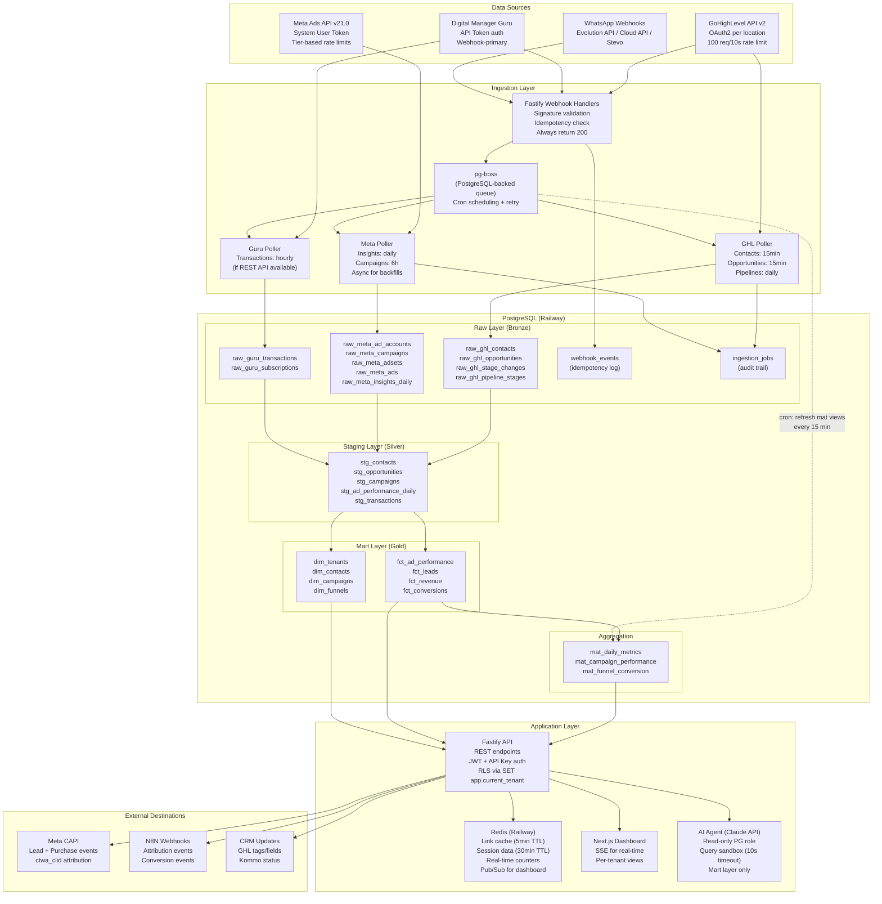

# Data Architecture Research — WaTrack Multi-Source Analytics Platform

> **Research Date:** 2026-03-13
> **Status:** Complete — Ready for Implementation Review
> **Scope:** GoHighLevel CRM + Meta Ads API + Digital Manager Guru + PostgreSQL on Railway/Supabase
> **Validation:** All recommendations verified against official API documentation and authoritative engineering sources. Items marked [NEEDS VERIFICATION] require hands-on testing or access to vendor documentation not publicly available.

---

## 1. Executive Summary

WaTrack is a multi-tenant SaaS that ingests data from three sources (GoHighLevel CRM, Meta Ads API, Digital Manager Guru payments) to provide WhatsApp campaign attribution and analytics. This document defines the data architecture for the next 3 years, targeting 10-200 GHL sub-accounts (tenants), each generating thousands of contacts/opportunities per month plus Meta Ads metrics and Guru transactions.

### Key Architectural Decisions

| Decision | Choice | Rationale |
|----------|--------|-----------|
| Database Engine | **PostgreSQL 15+ on Railway** (primary), Supabase as alternative | Sufficient for projected scale (<50GB/year), native RLS, JSONB for raw payloads, mature ecosystem |
| Schema Pattern | **Raw/Staging/Mart (Bronze-Silver-Gold)** | Preserves raw API payloads forever, enables reprocessing, clean separation of concerns |
| Multi-Tenancy | **Shared schema with RLS** (`location_id` on every table) | Best cost/complexity ratio for 10-200 tenants on a single PostgreSQL instance |
| Ingestion | **ELT with pg-boss** (PostgreSQL-backed job queue) | Eliminates Redis dependency for job scheduling; Redis reserved for caching/real-time only |
| Security | **RLS + encrypted credentials + LGPD compliance** | Defense-in-depth: RLS at DB layer, JWT with tenant claim at API layer, PII hashing |
| AI Agent | **Read-only PostgreSQL role + query sandbox + materialized views as semantic layer** | Safe, performant, no risk of data mutation |

### Scale Projections (3-year horizon)

| Metric | Year 1 (20 tenants) | Year 2 (80 tenants) | Year 3 (200 tenants) |
|--------|---------------------|---------------------|----------------------|
| Raw GHL contacts | ~500K rows | ~2M rows | ~5M rows |
| Raw Meta insights (daily) | ~200K rows | ~800K rows | ~2M rows |
| Raw Guru transactions | ~50K rows | ~200K rows | ~500K rows |
| Click events | ~1M rows | ~5M rows | ~15M rows |
| Total estimated DB size | ~5GB | ~20GB | ~50GB |

At this scale, plain PostgreSQL 15+ handles the workload comfortably. TimescaleDB or ClickHouse become relevant only if click_events exceed 50M rows/year or if sub-second dashboard queries over 100M+ rows are required.

---

## 2. Architecture Decision Records

### ADR-001: Database Engine — PostgreSQL 15+ on Railway

**Context:** The system needs a relational database that supports multi-tenant isolation (RLS), JSONB for raw API payloads, time-based partitioning, and materialized views for dashboard performance. Deployment target is Railway or Supabase.

**Options Considered:**

| Option | Pros | Cons |
|--------|------|------|
| **PostgreSQL 15+ (plain)** | Mature, RLS built-in, JSONB, partitioning, Railway/Supabase native support, huge ecosystem | Not optimized for heavy OLAP; aggregations over 100M+ rows may be slow |
| **TimescaleDB** | 20x faster time-series inserts, continuous aggregations, compression | Extension may not be available on all Railway plans; adds operational complexity; overkill for projected scale |
| **ClickHouse** | Extremely fast columnar OLAP, best for >50GB analytics | Separate infrastructure, no RLS, no ACID transactions, requires ETL pipeline to sync from PG |
| **DuckDB** | Embedded OLAP, great for AI agent queries | Not a production database; no multi-user access; useful only as a query layer |
| **Supabase** | Managed PG with RLS, Auth, Edge Functions, dashboard | Less control than Railway; fixed-instance pricing; vendor lock-in on Auth/Storage features |
| **Hybrid PG + ClickHouse** | Best of both worlds | Dual infrastructure cost, sync complexity, team needs ClickHouse expertise |

**Decision:** PostgreSQL 15+ on Railway as the primary database.

**Justification:**
- Projected data volume (5-50GB over 3 years) is well within PostgreSQL's comfortable range.
- Native RLS eliminates the need for application-level tenant filtering as a security net.
- JSONB columns store raw API payloads with zero schema overhead.
- Table partitioning (by month on click_events, by year on raw tables) keeps queries fast.
- Materialized views pre-compute dashboard KPIs, avoiding expensive real-time aggregations.
- Railway provides PostgreSQL with private networking (Wireguard-encrypted), automated backups, and HA cluster options.
- A single senior developer can manage this without specialized DBA knowledge.

**Consequences:**
- Dashboard queries over very large datasets (100M+ rows) may require careful index design and materialized view refresh scheduling.
- If scale exceeds projections significantly (>200 tenants, >100M rows), consider adding TimescaleDB extension or a ClickHouse read replica.
- Monitor query performance quarterly; the escape hatch to TimescaleDB is straightforward since it is a PostgreSQL extension.

**Sources:** [Railway PostgreSQL Docs](https://docs.railway.com/databases/postgresql), [PostgreSQL 15 Partitioning](https://www.postgresql.org/docs/15/ddl-partitioning.html)

---

### ADR-002: Schema Pattern — Raw/Staging/Mart (Bronze-Silver-Gold)

**Context:** Data arrives from three external APIs with different schemas, formats, and update frequencies. Raw data must be preserved indefinitely for debugging, reprocessing, and audit. Dashboard queries need pre-aggregated, clean data.

**Options Considered:**

| Option | Pros | Cons |
|--------|------|------|
| **Raw/Staging/Mart (3-layer)** | Full lineage, reprocessing capability, clean dashboard queries | More tables to manage, ETL logic between layers |
| **Single normalized schema** | Simple, fewer tables | Loses raw payloads; hard to reprocess; mixes ingestion concerns with query concerns |
| **Wide denormalized tables** | Fast reads, simple queries | Massive storage waste, schema changes are painful, no raw preservation |
| **Event sourcing** | Perfect audit trail, temporal queries | Complex to implement, requires event store infrastructure, overkill for API-sourced data |

**Decision:** Raw/Staging/Mart (Bronze-Silver-Gold) pattern.

**Justification:**
- **Raw layer (Bronze):** INSERT-only tables storing the complete API response as JSONB plus key extracted fields. Never modified after insert. This is the system of record.
- **Staging layer (Silver):** Cleaned, typed, deduplicated views of raw data. Handles timezone normalization, null coalescing, and data type casting. Rebuilt from raw on demand.
- **Mart layer (Gold):** Business-ready fact and dimension tables optimized for dashboard queries. Pre-joined, pre-filtered, with computed metrics.
- **Aggregation layer:** Materialized views for expensive KPIs (daily metrics, campaign performance, funnel conversion rates).

This pattern is the industry standard for API-sourced analytics (used by Fivetran, Airbyte, dbt). It provides full data lineage, enables reprocessing when business logic changes, and cleanly separates ingestion from presentation.

**Consequences:**
- Requires ETL jobs to promote data between layers (raw -> staging -> mart).
- Storage cost is higher due to data duplication across layers (~2-3x raw size).
- Schema migrations in mart layer don't affect raw data preservation.

**Sources:** [dbt Best Practices - How We Structure Our dbt Projects](https://docs.getdbt.com/best-practices/how-we-structure/1-guide-overview), [Fivetran Transformation Architecture](https://www.fivetran.com/blog/what-is-elt)

---

### ADR-003: Ingestion Architecture — ELT with pg-boss

**Context:** The system needs to poll three APIs on schedules (GHL contacts every 15min, Meta insights daily, Guru transactions hourly) plus receive webhooks in real-time. Jobs must be idempotent, retriable, and tenant-isolated.

**Options Considered:**

| Option | Pros | Cons |
|--------|------|------|
| **pg-boss (PG-backed queue)** | No Redis dependency, ACID guarantees, exactly-once delivery via SKIP LOCKED, built-in cron scheduling | Lower throughput than BullMQ (~2K jobs/sec vs ~27K); PostgreSQL WAL overhead for high-volume queues |
| **BullMQ (Redis-backed)** | 12x faster, mature, rich features (rate limiting, prioritization, delayed jobs) | Requires Redis infrastructure on Railway ($$$); Redis is a SPOF for job processing |
| **n8n workflows** | Visual, already in use by Triadeflow | Not embeddable in SaaS product; external dependency; hard to scale per-tenant; not suitable for multi-tenant job isolation |
| **Custom cron scripts** | Simple | No retry, no dead letter queue, no deduplication, no monitoring |
| **Temporal/Inngest** | Durable workflows, complex orchestration | Overkill for this use case; additional infrastructure |

**Decision:** pg-boss for scheduled ingestion jobs; direct webhook handlers for real-time events.

**Justification:**
- pg-boss uses PostgreSQL itself as the job store, eliminating the need for a separate Redis instance just for job queuing. This reduces Railway infrastructure cost and operational complexity.
- pg-boss provides: cron scheduling, exponential retry with configurable backoff, dead letter queues, job deduplication (singleton jobs per tenant), completion/failure callbacks, and monitoring.
- Throughput of ~2K jobs/sec is more than sufficient for 200 tenants polling 3 APIs.
- Redis is still used for caching (link metadata, session data, real-time counters) but is not a dependency for job reliability.
- Webhooks (GHL, Meta, Guru) are processed synchronously by Fastify handlers, then enqueued in pg-boss for async processing (DB writes, attribution matching).

**Consequences:**
- pg-boss adds ~5-10% overhead to PostgreSQL due to job table writes and WAL.
- If job volume exceeds 10K/hour, consider migrating to BullMQ with a dedicated Redis instance.
- Job monitoring requires querying the pg-boss schema tables directly (no separate dashboard like Bull Board).

**Sources:** [pg-boss GitHub](https://github.com/timgit/pg-boss), [BullMQ vs pg-boss comparison](https://npmtrends.com/bull-vs-bullmq-vs-pg-boss-vs-queue-vs-redis-node-vs-tiny-worker)

---

### ADR-004: Multi-Tenancy — Shared Schema with Row-Level Security

**Context:** Each GHL sub-account (`locationId`) is one tenant. The system needs strict data isolation so agency partners only see their own data, while super-admins can see aggregate views.

**Options Considered:**

| Option | Pros | Cons |
|--------|------|------|
| **Shared schema + RLS** | Lowest cost, simplest management, RLS enforced at DB level | Noisy neighbor risk; all tenants share same indexes; RLS adds ~5-15% query overhead |
| **Schema-per-tenant** | Strong logical isolation, per-tenant backup/restore | Schema management complexity grows linearly; cross-tenant queries require UNION ALL across schemas; migrations must run N times |
| **Database-per-tenant** | Strongest isolation, independent scaling | Highest cost; connection pooling nightmare; operational complexity at 200 tenants is unmanageable for a solo developer |

**Decision:** Shared schema with PostgreSQL Row-Level Security, `tenant_id UUID` on every data table.

**Justification:**
- For 10-200 tenants, shared schema is the industry standard (Stripe, Notion, Supabase all use this pattern).
- PostgreSQL RLS policies enforce isolation at the database level, meaning even a bug in application code cannot leak tenant data.
- `tenant_id` is propagated via `SET app.current_tenant = '{tenant_id}'` at the start of each database session/transaction. RLS policies check `current_setting('app.current_tenant')`.
- Super-admin queries bypass RLS by using a separate database role without RLS restrictions.
- Cross-tenant analytics for super-admins use a dedicated materialized view refreshed on schedule.

**Consequences:**
- Every table must have a `tenant_id` column with a NOT NULL constraint.
- Every query must be preceded by `SET app.current_tenant` (enforced by middleware).
- Composite indexes must include `tenant_id` as the leading column for optimal performance.
- Forgetting to set the tenant context results in zero rows returned (fail-safe behavior with RLS).

**Sources:** [AWS Multi-tenant RLS](https://aws.amazon.com/blogs/database/multi-tenant-data-isolation-with-postgresql-row-level-security/), [Crunchy Data RLS for Tenants](https://www.crunchydata.com/blog/row-level-security-for-tenants-in-postgres), [The Nile - Shipping Multi-tenant SaaS with RLS](https://www.thenile.dev/blog/multi-tenant-rls)

---

### ADR-005: Security Controls Architecture

**Context:** The system stores PII (names, emails, phone numbers, CPF), OAuth tokens for three external services, and financial transaction data. LGPD compliance is mandatory for Brazilian data subjects.

**Decision:** Defense-in-depth with four layers:

1. **Network layer:** PostgreSQL on Railway private network (Wireguard-encrypted, no public IP). Application connects via internal DNS (`postgres.railway.internal`).
2. **Database layer:** RLS for tenant isolation. Separate PostgreSQL roles for ingestion (INSERT on raw tables), query service (SELECT on staging/mart), AI agent (SELECT on mart only), and migration service (DDL).
3. **Application layer:** JWT with `tenant_id` claim. API key authentication for machine-to-machine (N8N, CRM webhooks). Webhook signature validation for each source (GHL Ed25519, Meta hub.verify_token, Guru token-in-payload).
4. **Data layer:** PII fields hashed with SHA-256 for deduplication (phone, CPF). OAuth tokens encrypted at rest using AES-256-GCM via `pgcrypto` or application-level encryption. Raw JSONB payloads stored as-is (contain PII — subject to LGPD retention policy).

**Sources:** [GHL Webhook Authentication](https://marketplace.gohighlevel.com/docs/webhook/WebhookIntegrationGuide/index.html), [Meta Webhook Verification](https://developers.facebook.com/docs/graph-api/webhooks/getting-started), [LGPD Compliance for SaaS](https://complydog.com/blog/brazil-lgpd-complete-data-protection-compliance-guide-saas)

---

### ADR-006: AI Agent Query Layer

**Context:** An optional AI agent (Claude API) needs to query the database in natural language to answer questions like "What was the ROAS for campaign X last month?" or "Which creative had the highest lead-to-sale rate?"

**Decision:** Read-only PostgreSQL role querying materialized views, with query sandboxing.

**Implementation:**
- Dedicated `ai_agent` PostgreSQL role with `SELECT` only on mart-layer tables and materialized views.
- RLS still applies — AI queries are automatically scoped to the tenant.
- Query timeout set to 10 seconds (`SET statement_timeout = '10s'`).
- Row limit enforced via `LIMIT 10000` appended to all AI-generated queries.
- Schema documentation provided to LLM as column comments (`COMMENT ON COLUMN`) and a data dictionary in the system prompt.
- Few-shot examples of correct SQL queries included in the prompt for common metrics (ROAS, CPL, CAC, funnel conversion rates).
- SQL generation uses temperature=0.0 for deterministic output.
- Generated SQL is validated (parsed for syntax, checked for no DDL/DML) before execution.

**Sources:** [Best Practices for Text-to-SQL Agents](https://medium.com/@ezinsightsai/best-practices-for-building-robust-text-to-sql-agents-f81d4c4ea6b3), [Natural Language Postgres Guide](https://ai-sdk.dev/cookbook/guides/natural-language-postgres)

---

## 3. Complete Database Schema (DDL)

### 3.0 — Extensions and Roles

```sql
-- ============================================================
-- WaTrack Database Schema — PostgreSQL 15+
-- Version: 1.0.0
-- Date: 2026-03-13
-- Pattern: Raw/Staging/Mart (Bronze-Silver-Gold)
-- Multi-tenancy: Shared schema with RLS (tenant_id on every table)
-- ============================================================

-- Required extensions
CREATE EXTENSION IF NOT EXISTS "uuid-ossp";       -- UUID generation
CREATE EXTENSION IF NOT EXISTS "pgcrypto";         -- Encryption for OAuth tokens, PII hashing
CREATE EXTENSION IF NOT EXISTS "pg_trgm";          -- Trigram similarity for text search

-- Database roles (defense-in-depth)
-- Run as superuser during setup only

-- Ingestion service: can INSERT into raw tables, read lookup tables
CREATE ROLE watrack_ingestion NOLOGIN;

-- Query service (dashboard API): can SELECT from staging/mart/materialized views
CREATE ROLE watrack_query NOLOGIN;

-- AI agent: can SELECT from mart tables and materialized views only
CREATE ROLE watrack_ai_agent NOLOGIN;

-- Migration service: full DDL access (used only during deployments)
CREATE ROLE watrack_migrations NOLOGIN;

-- Application login role (inherits from above based on context)
CREATE ROLE watrack_app LOGIN PASSWORD 'SET_VIA_ENV_VAR';
GRANT watrack_ingestion TO watrack_app;
GRANT watrack_query TO watrack_app;
```

### 3.1 — Foundation Tables

```sql
-- ============================================================
-- FOUNDATION LAYER — System tables
-- ============================================================

-- Tenants: one per GHL sub-account (locationId)
CREATE TABLE tenants (
    id              UUID PRIMARY KEY DEFAULT uuid_generate_v4(),
    name            VARCHAR(255) NOT NULL,
    slug            VARCHAR(100) UNIQUE NOT NULL,
    ghl_location_id VARCHAR(100) UNIQUE,           -- GHL sub-account identifier
    plan            VARCHAR(50) DEFAULT 'starter',  -- starter | pro | business | agency
    settings        JSONB DEFAULT '{}',             -- tenant-specific config (attribution window, CRM mappings, etc.)
    is_active       BOOLEAN DEFAULT true,
    created_at      TIMESTAMPTZ NOT NULL DEFAULT NOW(),
    updated_at      TIMESTAMPTZ NOT NULL DEFAULT NOW()
);

COMMENT ON TABLE tenants IS 'One tenant per GHL sub-account (locationId). Central entity for multi-tenancy.';
COMMENT ON COLUMN tenants.ghl_location_id IS 'GoHighLevel locationId — unique identifier for the sub-account.';
COMMENT ON COLUMN tenants.plan IS 'Subscription tier: starter (5 campaigns), pro (20), business (100), agency (unlimited).';
COMMENT ON COLUMN tenants.settings IS 'JSON config: attribution_window_days, default_currency, crm_stage_mappings, meta_pixel_overrides.';

CREATE INDEX idx_tenants_ghl_location ON tenants(ghl_location_id) WHERE ghl_location_id IS NOT NULL;
CREATE INDEX idx_tenants_slug ON tenants(slug);

-- ============================================================

-- Data source credentials: encrypted OAuth tokens per source per tenant
CREATE TABLE data_source_credentials (
    id              UUID PRIMARY KEY DEFAULT uuid_generate_v4(),
    tenant_id       UUID NOT NULL REFERENCES tenants(id) ON DELETE CASCADE,
    source_type     VARCHAR(50) NOT NULL,           -- 'ghl' | 'meta_ads' | 'guru'
    credential_type VARCHAR(50) NOT NULL,           -- 'oauth2' | 'api_key' | 'token'
    -- Encrypted fields: use pgcrypto or application-level AES-256-GCM
    encrypted_access_token   BYTEA,                 -- AES-256-GCM encrypted
    encrypted_refresh_token  BYTEA,                 -- AES-256-GCM encrypted (OAuth2 only)
    token_expires_at         TIMESTAMPTZ,           -- When the access token expires
    scopes                   TEXT[],                -- OAuth2 scopes granted
    metadata                 JSONB DEFAULT '{}',    -- source-specific: ghl_company_id, meta_ad_account_id, guru_api_version
    is_active                BOOLEAN DEFAULT true,
    last_refreshed_at        TIMESTAMPTZ,
    created_at               TIMESTAMPTZ NOT NULL DEFAULT NOW(),
    updated_at               TIMESTAMPTZ NOT NULL DEFAULT NOW(),
    UNIQUE(tenant_id, source_type)
);

COMMENT ON TABLE data_source_credentials IS 'Encrypted OAuth tokens and API keys for each data source per tenant.';
COMMENT ON COLUMN data_source_credentials.encrypted_access_token IS 'AES-256-GCM encrypted access token. Decrypt only in memory, never log.';
COMMENT ON COLUMN data_source_credentials.encrypted_refresh_token IS 'AES-256-GCM encrypted refresh token. Used for GHL OAuth2 token rotation.';

CREATE INDEX idx_credentials_tenant_source ON data_source_credentials(tenant_id, source_type);

-- ============================================================

-- Ingestion jobs: audit log of every sync run
CREATE TABLE ingestion_jobs (
    id              UUID PRIMARY KEY DEFAULT uuid_generate_v4(),
    tenant_id       UUID NOT NULL REFERENCES tenants(id) ON DELETE CASCADE,
    source_type     VARCHAR(50) NOT NULL,           -- 'ghl' | 'meta_ads' | 'guru'
    job_type        VARCHAR(50) NOT NULL,           -- 'full_sync' | 'incremental' | 'webhook_process' | 'reconciliation'
    entity_type     VARCHAR(100) NOT NULL,          -- 'contacts' | 'opportunities' | 'campaigns' | 'insights' | 'transactions'
    status          VARCHAR(50) NOT NULL DEFAULT 'pending', -- 'pending' | 'running' | 'completed' | 'failed' | 'cancelled'
    records_fetched INTEGER DEFAULT 0,
    records_inserted INTEGER DEFAULT 0,
    records_updated INTEGER DEFAULT 0,
    records_skipped INTEGER DEFAULT 0,
    error_message   TEXT,
    error_details   JSONB,                          -- Full error stack for debugging
    cursor_state    JSONB,                          -- Pagination cursor for resume (startAfter, startAfterId for GHL)
    started_at      TIMESTAMPTZ,
    completed_at    TIMESTAMPTZ,
    duration_ms     INTEGER,
    created_at      TIMESTAMPTZ NOT NULL DEFAULT NOW()
);

COMMENT ON TABLE ingestion_jobs IS 'Audit trail of every data sync execution. Used for monitoring, debugging, and resume-on-failure.';
COMMENT ON COLUMN ingestion_jobs.cursor_state IS 'Stores pagination state for incremental syncs. GHL: {startAfter, startAfterId}. Meta: {after_cursor}. Guru: {page, last_id}.';

CREATE INDEX idx_ingestion_jobs_tenant ON ingestion_jobs(tenant_id, created_at DESC);
CREATE INDEX idx_ingestion_jobs_status ON ingestion_jobs(status) WHERE status IN ('pending', 'running');

-- ============================================================

-- Webhook events: raw webhook payload log with idempotency
CREATE TABLE webhook_events (
    id              UUID PRIMARY KEY DEFAULT uuid_generate_v4(),
    tenant_id       UUID REFERENCES tenants(id),    -- NULL if tenant not yet identified
    source_type     VARCHAR(50) NOT NULL,           -- 'ghl' | 'meta' | 'guru' | 'evolution' | 'cloud_api' | 'stevo'
    event_type      VARCHAR(100) NOT NULL,          -- 'contact.created' | 'opportunity.stageChange' | 'sale.approved' | etc.
    idempotency_key VARCHAR(255) NOT NULL,          -- Unique key to detect duplicate deliveries
    raw_payload     JSONB NOT NULL,                 -- Complete webhook payload as received
    raw_headers     JSONB,                          -- Request headers (for signature validation audit)
    processing_status VARCHAR(50) DEFAULT 'received', -- 'received' | 'processing' | 'processed' | 'failed' | 'duplicate'
    error_message   TEXT,
    processed_at    TIMESTAMPTZ,
    received_at     TIMESTAMPTZ NOT NULL DEFAULT NOW(),
    UNIQUE(source_type, idempotency_key)
);

COMMENT ON TABLE webhook_events IS 'Immutable log of every webhook received. Idempotency key prevents duplicate processing.';
COMMENT ON COLUMN webhook_events.idempotency_key IS 'Derived from webhook payload: GHL=event_id, Meta=entry.id+change.value.messages[0].id, Guru=transaction_id+status, Stevo=conversationId+timestamp.';

CREATE INDEX idx_webhook_events_idempotency ON webhook_events(source_type, idempotency_key);
CREATE INDEX idx_webhook_events_tenant ON webhook_events(tenant_id, received_at DESC) WHERE tenant_id IS NOT NULL;
CREATE INDEX idx_webhook_events_status ON webhook_events(processing_status) WHERE processing_status IN ('received', 'processing');
```

### 3.2 — Raw Layer (Bronze) — Never Modified After Insert

```sql
-- ============================================================
-- RAW LAYER (BRONZE) — Immutable, append-only
-- Rule: Once inserted, NEVER UPDATE or DELETE. Only INSERT.
-- Every table has: tenant_id, source_id, raw_payload (JSONB), fetched_at
-- ============================================================

-- GHL Contacts (raw)
CREATE TABLE raw_ghl_contacts (
    id              UUID PRIMARY KEY DEFAULT uuid_generate_v4(),
    tenant_id       UUID NOT NULL REFERENCES tenants(id) ON DELETE CASCADE,
    ghl_contact_id  VARCHAR(100) NOT NULL,          -- GHL's internal contact ID
    raw_payload     JSONB NOT NULL,                 -- Complete GHL API response for this contact
    fetched_at      TIMESTAMPTZ NOT NULL DEFAULT NOW(), -- When we pulled from GHL API
    ingestion_job_id UUID REFERENCES ingestion_jobs(id),
    source          VARCHAR(20) DEFAULT 'poll',     -- 'poll' | 'webhook'
    created_at      TIMESTAMPTZ NOT NULL DEFAULT NOW()
);

COMMENT ON TABLE raw_ghl_contacts IS 'Raw GHL contact records. One row per fetch — same contact may appear multiple times (SCD tracking).';
COMMENT ON COLUMN raw_ghl_contacts.ghl_contact_id IS 'GHL contact ID from API response. NOT unique in this table (multiple snapshots).';

CREATE INDEX idx_raw_ghl_contacts_tenant ON raw_ghl_contacts(tenant_id, fetched_at DESC);
CREATE INDEX idx_raw_ghl_contacts_source_id ON raw_ghl_contacts(tenant_id, ghl_contact_id, fetched_at DESC);

-- ============================================================

-- GHL Opportunities (raw)
CREATE TABLE raw_ghl_opportunities (
    id              UUID PRIMARY KEY DEFAULT uuid_generate_v4(),
    tenant_id       UUID NOT NULL REFERENCES tenants(id) ON DELETE CASCADE,
    ghl_opportunity_id VARCHAR(100) NOT NULL,
    ghl_pipeline_id VARCHAR(100),
    ghl_stage_id    VARCHAR(100),
    monetary_value  DECIMAL(12,2),
    status          VARCHAR(50),                    -- 'open' | 'won' | 'lost' | 'abandoned'
    raw_payload     JSONB NOT NULL,
    fetched_at      TIMESTAMPTZ NOT NULL DEFAULT NOW(),
    ingestion_job_id UUID REFERENCES ingestion_jobs(id),
    source          VARCHAR(20) DEFAULT 'poll',
    created_at      TIMESTAMPTZ NOT NULL DEFAULT NOW()
);

COMMENT ON TABLE raw_ghl_opportunities IS 'Raw GHL opportunity snapshots. Stage and status changes tracked via multiple rows over time.';
COMMENT ON COLUMN raw_ghl_opportunities.status IS 'GHL opportunity status: open, won, lost, abandoned. Critical for funnel analytics.';

CREATE INDEX idx_raw_ghl_opps_tenant ON raw_ghl_opportunities(tenant_id, fetched_at DESC);
CREATE INDEX idx_raw_ghl_opps_source_id ON raw_ghl_opportunities(tenant_id, ghl_opportunity_id, fetched_at DESC);

-- ============================================================

-- GHL Opportunity Stage Changes (raw — from webhooks)
CREATE TABLE raw_ghl_opportunity_stage_changes (
    id              UUID PRIMARY KEY DEFAULT uuid_generate_v4(),
    tenant_id       UUID NOT NULL REFERENCES tenants(id) ON DELETE CASCADE,
    ghl_opportunity_id VARCHAR(100) NOT NULL,
    ghl_pipeline_id VARCHAR(100),
    old_stage_id    VARCHAR(100),
    new_stage_id    VARCHAR(100),
    old_status      VARCHAR(50),
    new_status      VARCHAR(50),
    monetary_value  DECIMAL(12,2),
    raw_payload     JSONB NOT NULL,                 -- Complete webhook payload
    event_at        TIMESTAMPTZ NOT NULL,           -- When the stage change occurred (from webhook timestamp)
    fetched_at      TIMESTAMPTZ NOT NULL DEFAULT NOW(),
    created_at      TIMESTAMPTZ NOT NULL DEFAULT NOW()
);

COMMENT ON TABLE raw_ghl_opportunity_stage_changes IS 'Stage change events from GHL webhooks. Critical for funnel analysis and SCD Type 2 tracking.';
COMMENT ON COLUMN raw_ghl_opportunity_stage_changes.event_at IS 'Timestamp from GHL webhook payload — when the stage actually changed, not when we received it.';

CREATE INDEX idx_raw_ghl_stage_changes_tenant ON raw_ghl_opportunity_stage_changes(tenant_id, event_at DESC);
CREATE INDEX idx_raw_ghl_stage_changes_opp ON raw_ghl_opportunity_stage_changes(ghl_opportunity_id, event_at DESC);

-- ============================================================

-- GHL Pipeline Stages (raw — reference/dimension data)
CREATE TABLE raw_ghl_pipeline_stages (
    id              UUID PRIMARY KEY DEFAULT uuid_generate_v4(),
    tenant_id       UUID NOT NULL REFERENCES tenants(id) ON DELETE CASCADE,
    ghl_pipeline_id VARCHAR(100) NOT NULL,
    ghl_stage_id    VARCHAR(100) NOT NULL,
    pipeline_name   VARCHAR(255),
    stage_name      VARCHAR(255),
    stage_position  INTEGER,
    raw_payload     JSONB NOT NULL,
    fetched_at      TIMESTAMPTZ NOT NULL DEFAULT NOW(),
    created_at      TIMESTAMPTZ NOT NULL DEFAULT NOW()
);

COMMENT ON TABLE raw_ghl_pipeline_stages IS 'GHL pipeline and stage definitions. Fetched periodically to track stage renames/reorders.';

CREATE INDEX idx_raw_ghl_pipelines_tenant ON raw_ghl_pipeline_stages(tenant_id, ghl_pipeline_id);

-- ============================================================

-- Meta Ad Accounts (raw)
CREATE TABLE raw_meta_ad_accounts (
    id              UUID PRIMARY KEY DEFAULT uuid_generate_v4(),
    tenant_id       UUID NOT NULL REFERENCES tenants(id) ON DELETE CASCADE,
    meta_account_id VARCHAR(100) NOT NULL,          -- act_{ad_account_id}
    account_name    VARCHAR(255),
    currency        CHAR(3),                        -- BRL, USD, etc.
    timezone_name   VARCHAR(100),                   -- e.g., 'America/Sao_Paulo'
    raw_payload     JSONB NOT NULL,
    fetched_at      TIMESTAMPTZ NOT NULL DEFAULT NOW(),
    created_at      TIMESTAMPTZ NOT NULL DEFAULT NOW()
);

COMMENT ON TABLE raw_meta_ad_accounts IS 'Meta Ad Account metadata. Timezone is critical for date normalization.';
COMMENT ON COLUMN raw_meta_ad_accounts.timezone_name IS 'Meta reports dates in the ad account timezone. Must normalize to UTC for storage.';

CREATE INDEX idx_raw_meta_accounts_tenant ON raw_meta_ad_accounts(tenant_id, meta_account_id);

-- ============================================================

-- Meta Campaigns (raw)
CREATE TABLE raw_meta_campaigns (
    id              UUID PRIMARY KEY DEFAULT uuid_generate_v4(),
    tenant_id       UUID NOT NULL REFERENCES tenants(id) ON DELETE CASCADE,
    meta_campaign_id VARCHAR(100) NOT NULL,
    meta_account_id VARCHAR(100) NOT NULL,
    campaign_name   VARCHAR(500),
    objective       VARCHAR(100),
    status          VARCHAR(50),                    -- ACTIVE, PAUSED, ARCHIVED
    raw_payload     JSONB NOT NULL,
    fetched_at      TIMESTAMPTZ NOT NULL DEFAULT NOW(),
    created_at      TIMESTAMPTZ NOT NULL DEFAULT NOW()
);

COMMENT ON TABLE raw_meta_campaigns IS 'Meta Ads campaign definitions.';

CREATE INDEX idx_raw_meta_campaigns_tenant ON raw_meta_campaigns(tenant_id, meta_campaign_id, fetched_at DESC);

-- ============================================================

-- Meta AdSets (raw)
CREATE TABLE raw_meta_adsets (
    id              UUID PRIMARY KEY DEFAULT uuid_generate_v4(),
    tenant_id       UUID NOT NULL REFERENCES tenants(id) ON DELETE CASCADE,
    meta_adset_id   VARCHAR(100) NOT NULL,
    meta_campaign_id VARCHAR(100) NOT NULL,
    adset_name      VARCHAR(500),
    targeting       JSONB,                          -- Audience targeting config
    status          VARCHAR(50),
    raw_payload     JSONB NOT NULL,
    fetched_at      TIMESTAMPTZ NOT NULL DEFAULT NOW(),
    created_at      TIMESTAMPTZ NOT NULL DEFAULT NOW()
);

CREATE INDEX idx_raw_meta_adsets_tenant ON raw_meta_adsets(tenant_id, meta_adset_id, fetched_at DESC);

-- ============================================================

-- Meta Ads (raw)
CREATE TABLE raw_meta_ads (
    id              UUID PRIMARY KEY DEFAULT uuid_generate_v4(),
    tenant_id       UUID NOT NULL REFERENCES tenants(id) ON DELETE CASCADE,
    meta_ad_id      VARCHAR(100) NOT NULL,
    meta_adset_id   VARCHAR(100) NOT NULL,
    meta_campaign_id VARCHAR(100) NOT NULL,
    ad_name         VARCHAR(500),
    creative_id     VARCHAR(100),
    status          VARCHAR(50),
    raw_payload     JSONB NOT NULL,
    fetched_at      TIMESTAMPTZ NOT NULL DEFAULT NOW(),
    created_at      TIMESTAMPTZ NOT NULL DEFAULT NOW()
);

COMMENT ON TABLE raw_meta_ads IS 'Meta ad definitions. The meta_ad_id is the source_id used for attribution matching with GHL contacts.';

CREATE INDEX idx_raw_meta_ads_tenant ON raw_meta_ads(tenant_id, meta_ad_id, fetched_at DESC);

-- ============================================================

-- Meta Insights Daily (raw — partitioned by date)
CREATE TABLE raw_meta_insights_daily (
    id              UUID NOT NULL DEFAULT uuid_generate_v4(),
    tenant_id       UUID NOT NULL,
    meta_ad_id      VARCHAR(100) NOT NULL,
    meta_adset_id   VARCHAR(100),
    meta_campaign_id VARCHAR(100),
    meta_account_id VARCHAR(100) NOT NULL,
    report_date     DATE NOT NULL,                  -- The date this insight row covers (in account TZ, normalized to UTC)
    -- Key metrics extracted for fast querying
    impressions     BIGINT DEFAULT 0,
    clicks          BIGINT DEFAULT 0,
    spend           DECIMAL(12,4) DEFAULT 0,        -- 4 decimal places for currency precision
    reach           BIGINT DEFAULT 0,
    cpm             DECIMAL(10,4) DEFAULT 0,
    cpc             DECIMAL(10,4) DEFAULT 0,
    ctr             DECIMAL(8,6) DEFAULT 0,
    frequency       DECIMAL(8,4) DEFAULT 0,
    -- Attribution-specific
    actions         JSONB,                          -- Array of {action_type, value} from Meta
    conversions     JSONB,                          -- Conversion events
    cost_per_action_type JSONB,
    -- Raw preservation
    raw_payload     JSONB NOT NULL,                 -- Full insights response
    attribution_window VARCHAR(50),                 -- e.g., '7d_click' | '1d_click' | '1d_view'
    fetched_at      TIMESTAMPTZ NOT NULL DEFAULT NOW(),
    ingestion_job_id UUID,
    created_at      TIMESTAMPTZ NOT NULL DEFAULT NOW(),
    PRIMARY KEY (id, report_date)
) PARTITION BY RANGE (report_date);

COMMENT ON TABLE raw_meta_insights_daily IS 'Daily ad performance metrics from Meta Insights API. Partitioned by report_date for efficient time-range queries.';
COMMENT ON COLUMN raw_meta_insights_daily.spend IS 'Ad spend in the ad account currency (usually BRL). 4 decimal places for precise financial calculations.';
COMMENT ON COLUMN raw_meta_insights_daily.attribution_window IS 'Meta attribution window used when fetching: 7d_click (default), 1d_click, 1d_view. IMPORTANT: As of Jan 2026, 7d_view and 28d_view are deprecated.';
COMMENT ON COLUMN raw_meta_insights_daily.actions IS 'Array of Meta action objects: [{action_type: "link_click", value: "42"}, {action_type: "lead", value: "5"}].';

-- Create monthly partitions (auto-create via pg_partman or manual)
CREATE TABLE raw_meta_insights_daily_2026_01 PARTITION OF raw_meta_insights_daily
    FOR VALUES FROM ('2026-01-01') TO ('2026-02-01');
CREATE TABLE raw_meta_insights_daily_2026_02 PARTITION OF raw_meta_insights_daily
    FOR VALUES FROM ('2026-02-01') TO ('2026-03-01');
CREATE TABLE raw_meta_insights_daily_2026_03 PARTITION OF raw_meta_insights_daily
    FOR VALUES FROM ('2026-03-01') TO ('2026-04-01');
CREATE TABLE raw_meta_insights_daily_2026_04 PARTITION OF raw_meta_insights_daily
    FOR VALUES FROM ('2026-04-01') TO ('2026-05-01');
CREATE TABLE raw_meta_insights_daily_2026_05 PARTITION OF raw_meta_insights_daily
    FOR VALUES FROM ('2026-05-01') TO ('2026-06-01');
CREATE TABLE raw_meta_insights_daily_2026_06 PARTITION OF raw_meta_insights_daily
    FOR VALUES FROM ('2026-06-01') TO ('2026-07-01');
CREATE TABLE raw_meta_insights_daily_2026_07 PARTITION OF raw_meta_insights_daily
    FOR VALUES FROM ('2026-07-01') TO ('2026-08-01');
CREATE TABLE raw_meta_insights_daily_2026_08 PARTITION OF raw_meta_insights_daily
    FOR VALUES FROM ('2026-08-01') TO ('2026-09-01');
CREATE TABLE raw_meta_insights_daily_2026_09 PARTITION OF raw_meta_insights_daily
    FOR VALUES FROM ('2026-09-01') TO ('2026-10-01');
CREATE TABLE raw_meta_insights_daily_2026_10 PARTITION OF raw_meta_insights_daily
    FOR VALUES FROM ('2026-10-01') TO ('2026-11-01');
CREATE TABLE raw_meta_insights_daily_2026_11 PARTITION OF raw_meta_insights_daily
    FOR VALUES FROM ('2026-11-01') TO ('2026-12-01');
CREATE TABLE raw_meta_insights_daily_2026_12 PARTITION OF raw_meta_insights_daily
    FOR VALUES FROM ('2026-12-01') TO ('2027-01-01');
CREATE TABLE raw_meta_insights_daily_default PARTITION OF raw_meta_insights_daily DEFAULT;

CREATE INDEX idx_raw_meta_insights_tenant ON raw_meta_insights_daily(tenant_id, report_date DESC);
CREATE INDEX idx_raw_meta_insights_ad ON raw_meta_insights_daily(meta_ad_id, report_date DESC);
CREATE INDEX idx_raw_meta_insights_campaign ON raw_meta_insights_daily(meta_campaign_id, report_date DESC);

-- ============================================================

-- Guru Transactions (raw)
CREATE TABLE raw_guru_transactions (
    id              UUID PRIMARY KEY DEFAULT uuid_generate_v4(),
    tenant_id       UUID NOT NULL REFERENCES tenants(id) ON DELETE CASCADE,
    guru_transaction_id VARCHAR(100) NOT NULL,
    product_id      VARCHAR(100),
    product_name    VARCHAR(500),
    transaction_status VARCHAR(50) NOT NULL,         -- 'approved' | 'refunded' | 'chargeback' | 'canceled' | 'pending' | 'waiting_payment'
    transaction_type VARCHAR(50),                    -- 'sale' | 'subscription' | 'upsell' | 'order_bump'
    payment_method  VARCHAR(50),                     -- 'credit_card' | 'pix' | 'boleto'
    total_value     DECIMAL(12,2),                   -- Transaction amount in BRL
    currency        CHAR(3) DEFAULT 'BRL',
    installments    INTEGER DEFAULT 1,
    buyer_name      VARCHAR(255),
    buyer_email     VARCHAR(255),
    buyer_phone     VARCHAR(50),
    buyer_document  VARCHAR(50),                     -- CPF/CNPJ — PII, consider hashing
    -- UTM tracking from Guru checkout
    utm_source      VARCHAR(255),
    utm_medium      VARCHAR(255),
    utm_campaign    VARCHAR(255),
    utm_content     VARCHAR(255),
    utm_term        VARCHAR(255),
    -- Affiliate data
    affiliate_id    VARCHAR(100),
    affiliate_name  VARCHAR(255),
    commission_value DECIMAL(12,2),
    -- Raw preservation
    raw_payload     JSONB NOT NULL,
    source          VARCHAR(20) DEFAULT 'webhook',   -- 'webhook' | 'poll'
    event_at        TIMESTAMPTZ,                     -- When the transaction event occurred (from Guru payload)
    fetched_at      TIMESTAMPTZ NOT NULL DEFAULT NOW(),
    created_at      TIMESTAMPTZ NOT NULL DEFAULT NOW()
);

COMMENT ON TABLE raw_guru_transactions IS 'Raw transaction records from Digital Manager Guru. Includes sales, refunds, chargebacks. One row per webhook event (same transaction may appear with different statuses).';
COMMENT ON COLUMN raw_guru_transactions.guru_transaction_id IS 'Guru internal transaction ID. NOT unique in this table — same transaction emits multiple webhook events (pending -> approved -> etc).';
COMMENT ON COLUMN raw_guru_transactions.buyer_document IS 'CPF or CNPJ of the buyer. PII under LGPD — hash for dedup, encrypt for storage if needed.';

CREATE INDEX idx_raw_guru_tx_tenant ON raw_guru_transactions(tenant_id, event_at DESC);
CREATE INDEX idx_raw_guru_tx_source_id ON raw_guru_transactions(tenant_id, guru_transaction_id, event_at DESC);
CREATE INDEX idx_raw_guru_tx_buyer_phone ON raw_guru_transactions(tenant_id, buyer_phone) WHERE buyer_phone IS NOT NULL;

-- ============================================================

-- Guru Subscriptions (raw)
CREATE TABLE raw_guru_subscriptions (
    id              UUID PRIMARY KEY DEFAULT uuid_generate_v4(),
    tenant_id       UUID NOT NULL REFERENCES tenants(id) ON DELETE CASCADE,
    guru_subscription_id VARCHAR(100) NOT NULL,
    guru_transaction_id VARCHAR(100),                -- The originating transaction
    product_id      VARCHAR(100),
    plan_name       VARCHAR(255),
    status          VARCHAR(50) NOT NULL,            -- 'active' | 'canceled' | 'expired' | 'overdue' | 'trial'
    billing_cycle   VARCHAR(50),                     -- 'monthly' | 'yearly' | 'weekly'
    next_billing_at TIMESTAMPTZ,
    canceled_at     TIMESTAMPTZ,
    buyer_email     VARCHAR(255),
    buyer_phone     VARCHAR(50),
    raw_payload     JSONB NOT NULL,
    event_at        TIMESTAMPTZ,
    fetched_at      TIMESTAMPTZ NOT NULL DEFAULT NOW(),
    created_at      TIMESTAMPTZ NOT NULL DEFAULT NOW()
);

COMMENT ON TABLE raw_guru_subscriptions IS 'Raw subscription records from Guru. Tracks lifecycle: trial -> active -> canceled/expired.';

CREATE INDEX idx_raw_guru_subs_tenant ON raw_guru_subscriptions(tenant_id, event_at DESC);
```

### 3.3 — Staging Layer (Silver) — Cleaned, Typed, Deduplicated

```sql
-- ============================================================
-- STAGING LAYER (SILVER) — Cleaned, deduplicated, typed
-- These are views or tables materialized from the raw layer.
-- Handles: dedup, timezone normalization, null coalescing, type casting
-- ============================================================

-- Staged contacts (latest version per contact)
CREATE TABLE stg_contacts (
    id              UUID PRIMARY KEY DEFAULT uuid_generate_v4(),
    tenant_id       UUID NOT NULL REFERENCES tenants(id) ON DELETE CASCADE,
    ghl_contact_id  VARCHAR(100) NOT NULL,
    first_name      VARCHAR(255),
    last_name       VARCHAR(255),
    email           VARCHAR(255),
    phone           VARCHAR(50),
    phone_hash      VARCHAR(64),                     -- SHA-256 of normalized phone for privacy-safe joins
    tags            TEXT[],                           -- Array of GHL tag names
    source          VARCHAR(255),                    -- Lead source field from GHL
    custom_fields   JSONB DEFAULT '{}',              -- Extracted custom fields (tenant-specific)
    ghl_created_at  TIMESTAMPTZ,                    -- When the contact was created in GHL
    ghl_updated_at  TIMESTAMPTZ,                    -- When last updated in GHL
    last_synced_at  TIMESTAMPTZ NOT NULL DEFAULT NOW(),
    created_at      TIMESTAMPTZ NOT NULL DEFAULT NOW(),
    updated_at      TIMESTAMPTZ NOT NULL DEFAULT NOW(),
    UNIQUE(tenant_id, ghl_contact_id)
);

COMMENT ON TABLE stg_contacts IS 'Deduplicated contacts — latest state per ghl_contact_id. Rebuilt from raw_ghl_contacts via upsert.';
COMMENT ON COLUMN stg_contacts.phone_hash IS 'SHA-256 hash of phone number (normalized to digits only). Used for privacy-safe joins with Guru transactions and WhatsApp conversations.';
COMMENT ON COLUMN stg_contacts.custom_fields IS 'GHL custom fields vary per location. Stored as JSONB with field name as key.';

CREATE INDEX idx_stg_contacts_tenant ON stg_contacts(tenant_id);
CREATE INDEX idx_stg_contacts_phone_hash ON stg_contacts(tenant_id, phone_hash) WHERE phone_hash IS NOT NULL;
CREATE INDEX idx_stg_contacts_email ON stg_contacts(tenant_id, email) WHERE email IS NOT NULL;
CREATE INDEX idx_stg_contacts_ghl_id ON stg_contacts(tenant_id, ghl_contact_id);

-- ============================================================

-- Staged opportunities (latest state with stage history pointer)
CREATE TABLE stg_opportunities (
    id              UUID PRIMARY KEY DEFAULT uuid_generate_v4(),
    tenant_id       UUID NOT NULL REFERENCES tenants(id) ON DELETE CASCADE,
    ghl_opportunity_id VARCHAR(100) NOT NULL,
    ghl_contact_id  VARCHAR(100),
    ghl_pipeline_id VARCHAR(100) NOT NULL,
    ghl_stage_id    VARCHAR(100),
    pipeline_name   VARCHAR(255),
    stage_name      VARCHAR(255),
    status          VARCHAR(50),                     -- 'open' | 'won' | 'lost' | 'abandoned'
    monetary_value  DECIMAL(12,2),
    currency        CHAR(3) DEFAULT 'BRL',
    assigned_to     VARCHAR(255),                    -- GHL user name
    source          VARCHAR(255),
    ghl_created_at  TIMESTAMPTZ,
    ghl_updated_at  TIMESTAMPTZ,
    last_synced_at  TIMESTAMPTZ NOT NULL DEFAULT NOW(),
    created_at      TIMESTAMPTZ NOT NULL DEFAULT NOW(),
    updated_at      TIMESTAMPTZ NOT NULL DEFAULT NOW(),
    UNIQUE(tenant_id, ghl_opportunity_id)
);

COMMENT ON TABLE stg_opportunities IS 'Latest state of each GHL opportunity. Stage history tracked in raw_ghl_opportunity_stage_changes.';

CREATE INDEX idx_stg_opps_tenant_pipeline ON stg_opportunities(tenant_id, ghl_pipeline_id, status);
CREATE INDEX idx_stg_opps_contact ON stg_opportunities(tenant_id, ghl_contact_id);

-- ============================================================

-- Staged campaigns (Meta + internal unified)
CREATE TABLE stg_campaigns (
    id              UUID PRIMARY KEY DEFAULT uuid_generate_v4(),
    tenant_id       UUID NOT NULL REFERENCES tenants(id) ON DELETE CASCADE,
    meta_campaign_id VARCHAR(100),
    meta_account_id VARCHAR(100),
    campaign_name   VARCHAR(500) NOT NULL,
    objective       VARCHAR(100),
    status          VARCHAR(50),
    channel         VARCHAR(50) DEFAULT 'meta_ads',  -- 'meta_ads' | 'google_ads' | 'tiktok_ads' | 'organic'
    currency        CHAR(3) DEFAULT 'BRL',
    timezone_name   VARCHAR(100),
    last_synced_at  TIMESTAMPTZ NOT NULL DEFAULT NOW(),
    created_at      TIMESTAMPTZ NOT NULL DEFAULT NOW(),
    updated_at      TIMESTAMPTZ NOT NULL DEFAULT NOW(),
    UNIQUE(tenant_id, meta_campaign_id)
);

CREATE INDEX idx_stg_campaigns_tenant ON stg_campaigns(tenant_id, status);

-- ============================================================

-- Staged daily ad performance (deduplicated, latest fetch per ad+date)
CREATE TABLE stg_ad_performance_daily (
    id              UUID PRIMARY KEY DEFAULT uuid_generate_v4(),
    tenant_id       UUID NOT NULL REFERENCES tenants(id) ON DELETE CASCADE,
    meta_ad_id      VARCHAR(100) NOT NULL,
    meta_adset_id   VARCHAR(100),
    meta_campaign_id VARCHAR(100) NOT NULL,
    report_date     DATE NOT NULL,
    impressions     BIGINT DEFAULT 0,
    clicks          BIGINT DEFAULT 0,
    spend           DECIMAL(12,4) DEFAULT 0,
    reach           BIGINT DEFAULT 0,
    cpm             DECIMAL(10,4) DEFAULT 0,
    cpc             DECIMAL(10,4) DEFAULT 0,
    ctr             DECIMAL(8,6) DEFAULT 0,
    frequency       DECIMAL(8,4) DEFAULT 0,
    conversions_lead INTEGER DEFAULT 0,
    conversions_purchase INTEGER DEFAULT 0,
    conversion_value DECIMAL(12,2) DEFAULT 0,
    attribution_window VARCHAR(50),
    last_synced_at  TIMESTAMPTZ NOT NULL DEFAULT NOW(),
    created_at      TIMESTAMPTZ NOT NULL DEFAULT NOW(),
    updated_at      TIMESTAMPTZ NOT NULL DEFAULT NOW(),
    UNIQUE(tenant_id, meta_ad_id, report_date, attribution_window)
);

COMMENT ON TABLE stg_ad_performance_daily IS 'Deduplicated daily metrics per ad. Handles Meta retroactive attribution: latest fetch always wins (upsert).';
COMMENT ON COLUMN stg_ad_performance_daily.attribution_window IS 'IMPORTANT: Meta deprecated 7d_view and 28d_view in Jan 2026. Use 7d_click as primary, 1d_click as secondary.';

CREATE INDEX idx_stg_ad_perf_tenant_date ON stg_ad_performance_daily(tenant_id, report_date DESC);
CREATE INDEX idx_stg_ad_perf_campaign ON stg_ad_performance_daily(meta_campaign_id, report_date DESC);

-- ============================================================

-- Staged transactions (latest status per Guru transaction)
CREATE TABLE stg_transactions (
    id              UUID PRIMARY KEY DEFAULT uuid_generate_v4(),
    tenant_id       UUID NOT NULL REFERENCES tenants(id) ON DELETE CASCADE,
    guru_transaction_id VARCHAR(100) NOT NULL,
    product_id      VARCHAR(100),
    product_name    VARCHAR(500),
    status          VARCHAR(50) NOT NULL,
    transaction_type VARCHAR(50),
    payment_method  VARCHAR(50),
    total_value     DECIMAL(12,2),
    net_value       DECIMAL(12,2),                   -- After platform fees
    currency        CHAR(3) DEFAULT 'BRL',
    installments    INTEGER DEFAULT 1,
    buyer_phone_hash VARCHAR(64),                    -- SHA-256 of buyer phone for privacy-safe joins
    buyer_email_hash VARCHAR(64),                    -- SHA-256 of buyer email
    -- UTMs from checkout for attribution
    utm_source      VARCHAR(255),
    utm_medium      VARCHAR(255),
    utm_campaign    VARCHAR(255),
    utm_content     VARCHAR(255),
    utm_term        VARCHAR(255),
    affiliate_id    VARCHAR(100),
    transaction_at  TIMESTAMPTZ NOT NULL,            -- When the transaction occurred
    last_synced_at  TIMESTAMPTZ NOT NULL DEFAULT NOW(),
    created_at      TIMESTAMPTZ NOT NULL DEFAULT NOW(),
    updated_at      TIMESTAMPTZ NOT NULL DEFAULT NOW(),
    UNIQUE(tenant_id, guru_transaction_id)
);

COMMENT ON TABLE stg_transactions IS 'Latest state of each Guru transaction. PII fields replaced with hashes for safe joining.';

CREATE INDEX idx_stg_tx_tenant ON stg_transactions(tenant_id, transaction_at DESC);
CREATE INDEX idx_stg_tx_buyer_phone ON stg_transactions(tenant_id, buyer_phone_hash) WHERE buyer_phone_hash IS NOT NULL;
CREATE INDEX idx_stg_tx_status ON stg_transactions(tenant_id, status);
```

### 3.4 — Mart Layer (Gold) — Business-Ready for Dashboard

```sql
-- ============================================================
-- MART LAYER (GOLD) — Business-ready fact and dimension tables
-- Optimized for dashboard queries. Pre-joined, pre-filtered.
-- ============================================================

-- Dimension: Tenants (denormalized for dashboard joins)
CREATE TABLE dim_tenants (
    tenant_id       UUID PRIMARY KEY REFERENCES tenants(id),
    name            VARCHAR(255) NOT NULL,
    slug            VARCHAR(100) NOT NULL,
    plan            VARCHAR(50),
    ghl_location_id VARCHAR(100),
    is_active       BOOLEAN,
    refreshed_at    TIMESTAMPTZ NOT NULL DEFAULT NOW()
);

COMMENT ON TABLE dim_tenants IS 'Slowly changing dimension for tenants. Refreshed daily.';

-- ============================================================

-- Dimension: Contacts (for attribution joins)
CREATE TABLE dim_contacts (
    id              UUID PRIMARY KEY,                -- Same as stg_contacts.id
    tenant_id       UUID NOT NULL REFERENCES tenants(id),
    ghl_contact_id  VARCHAR(100) NOT NULL,
    phone_hash      VARCHAR(64),
    email_hash      VARCHAR(64),                     -- SHA-256 of email
    first_name      VARCHAR(255),
    source          VARCHAR(255),
    tags            TEXT[],
    ghl_created_at  TIMESTAMPTZ,
    refreshed_at    TIMESTAMPTZ NOT NULL DEFAULT NOW()
);

COMMENT ON TABLE dim_contacts IS 'Contact dimension for fact table joins. PII minimized (hashes only).';

CREATE INDEX idx_dim_contacts_tenant ON dim_contacts(tenant_id);
CREATE INDEX idx_dim_contacts_phone ON dim_contacts(tenant_id, phone_hash) WHERE phone_hash IS NOT NULL;

-- ============================================================

-- Dimension: Campaigns (unified across sources)
CREATE TABLE dim_campaigns (
    id              UUID PRIMARY KEY,
    tenant_id       UUID NOT NULL REFERENCES tenants(id),
    meta_campaign_id VARCHAR(100),
    campaign_name   VARCHAR(500) NOT NULL,
    objective       VARCHAR(100),
    channel         VARCHAR(50),
    status          VARCHAR(50),
    refreshed_at    TIMESTAMPTZ NOT NULL DEFAULT NOW()
);

CREATE INDEX idx_dim_campaigns_tenant ON dim_campaigns(tenant_id);

-- ============================================================

-- Dimension: Funnels (GHL pipelines as funnels)
CREATE TABLE dim_funnels (
    id              UUID PRIMARY KEY DEFAULT uuid_generate_v4(),
    tenant_id       UUID NOT NULL REFERENCES tenants(id),
    ghl_pipeline_id VARCHAR(100) NOT NULL,
    funnel_name     VARCHAR(255) NOT NULL,
    stages          JSONB NOT NULL,                  -- Ordered array: [{id, name, position}]
    refreshed_at    TIMESTAMPTZ NOT NULL DEFAULT NOW(),
    UNIQUE(tenant_id, ghl_pipeline_id)
);

COMMENT ON TABLE dim_funnels IS 'GHL pipelines modeled as funnels. Stages array preserves order for conversion rate calculations.';

-- ============================================================

-- Fact: Ad Performance (grain: ad + day + tenant)
CREATE TABLE fct_ad_performance (
    id              UUID PRIMARY KEY DEFAULT uuid_generate_v4(),
    tenant_id       UUID NOT NULL REFERENCES tenants(id),
    campaign_id     UUID REFERENCES dim_campaigns(id),
    meta_ad_id      VARCHAR(100) NOT NULL,
    meta_adset_id   VARCHAR(100),
    meta_campaign_id VARCHAR(100),
    report_date     DATE NOT NULL,
    impressions     BIGINT DEFAULT 0,
    clicks          BIGINT DEFAULT 0,
    spend           DECIMAL(12,4) DEFAULT 0,
    reach           BIGINT DEFAULT 0,
    cpm             DECIMAL(10,4) DEFAULT 0,
    cpc             DECIMAL(10,4) DEFAULT 0,
    ctr             DECIMAL(8,6) DEFAULT 0,
    frequency       DECIMAL(8,4) DEFAULT 0,
    meta_conversions_lead INTEGER DEFAULT 0,
    meta_conversions_purchase INTEGER DEFAULT 0,
    meta_conversion_value DECIMAL(12,2) DEFAULT 0,
    refreshed_at    TIMESTAMPTZ NOT NULL DEFAULT NOW(),
    UNIQUE(tenant_id, meta_ad_id, report_date)
);

COMMENT ON TABLE fct_ad_performance IS 'Fact table: daily ad-level performance metrics. Grain: one row per ad per day per tenant.';

CREATE INDEX idx_fct_ad_perf_tenant_date ON fct_ad_performance(tenant_id, report_date DESC);
CREATE INDEX idx_fct_ad_perf_campaign ON fct_ad_performance(tenant_id, campaign_id, report_date DESC);

-- ============================================================

-- Fact: Leads (grain: contact + tenant)
CREATE TABLE fct_leads (
    id              UUID PRIMARY KEY DEFAULT uuid_generate_v4(),
    tenant_id       UUID NOT NULL REFERENCES tenants(id),
    contact_id      UUID REFERENCES dim_contacts(id),
    ghl_contact_id  VARCHAR(100) NOT NULL,
    phone_hash      VARCHAR(64),
    source          VARCHAR(255),                    -- Where the lead came from
    -- Attribution data (from WaTrack click tracking)
    attributed_campaign_id UUID REFERENCES dim_campaigns(id),
    attribution_method VARCHAR(50),                  -- 'reference_code' | 'ctwa_clid' | 'phone_window' | 'fingerprint' | 'organic'
    attribution_confidence DECIMAL(3,2),
    meta_ad_id      VARCHAR(100),                    -- The specific ad creative that generated this lead
    utm_source      VARCHAR(255),
    utm_medium      VARCHAR(255),
    utm_campaign    VARCHAR(255),
    -- Funnel position
    current_pipeline_id VARCHAR(100),
    current_stage_id VARCHAR(100),
    current_stage_name VARCHAR(255),
    opportunity_status VARCHAR(50),
    opportunity_value DECIMAL(12,2),
    -- Revenue (from Guru via phone_hash join)
    total_revenue   DECIMAL(12,2) DEFAULT 0,
    transaction_count INTEGER DEFAULT 0,
    first_purchase_at TIMESTAMPTZ,
    -- Timestamps
    lead_created_at TIMESTAMPTZ NOT NULL,            -- When the contact was created in GHL
    attributed_at   TIMESTAMPTZ,                     -- When WaTrack matched the attribution
    refreshed_at    TIMESTAMPTZ NOT NULL DEFAULT NOW()
);

COMMENT ON TABLE fct_leads IS 'Fact table: one row per lead (contact) with full attribution and revenue data. The core table for ROAS calculations.';
COMMENT ON COLUMN fct_leads.total_revenue IS 'Sum of approved Guru transactions matched by phone_hash. Updated when new transactions arrive.';

CREATE INDEX idx_fct_leads_tenant ON fct_leads(tenant_id, lead_created_at DESC);
CREATE INDEX idx_fct_leads_campaign ON fct_leads(tenant_id, attributed_campaign_id);
CREATE INDEX idx_fct_leads_ad ON fct_leads(tenant_id, meta_ad_id) WHERE meta_ad_id IS NOT NULL;
CREATE INDEX idx_fct_leads_phone ON fct_leads(tenant_id, phone_hash) WHERE phone_hash IS NOT NULL;

-- ============================================================

-- Fact: Revenue (grain: transaction + tenant)
CREATE TABLE fct_revenue (
    id              UUID PRIMARY KEY DEFAULT uuid_generate_v4(),
    tenant_id       UUID NOT NULL REFERENCES tenants(id),
    guru_transaction_id VARCHAR(100) NOT NULL,
    contact_id      UUID REFERENCES dim_contacts(id),
    lead_id         UUID REFERENCES fct_leads(id),
    attributed_campaign_id UUID REFERENCES dim_campaigns(id),
    meta_ad_id      VARCHAR(100),
    product_name    VARCHAR(500),
    status          VARCHAR(50) NOT NULL,
    payment_method  VARCHAR(50),
    gross_value     DECIMAL(12,2) NOT NULL,
    net_value       DECIMAL(12,2),
    currency        CHAR(3) DEFAULT 'BRL',
    is_refunded     BOOLEAN DEFAULT false,
    transaction_at  TIMESTAMPTZ NOT NULL,
    refreshed_at    TIMESTAMPTZ NOT NULL DEFAULT NOW(),
    UNIQUE(tenant_id, guru_transaction_id)
);

COMMENT ON TABLE fct_revenue IS 'Fact table: one row per Guru transaction, linked to leads and campaigns for ROAS attribution.';

CREATE INDEX idx_fct_revenue_tenant ON fct_revenue(tenant_id, transaction_at DESC);
CREATE INDEX idx_fct_revenue_campaign ON fct_revenue(tenant_id, attributed_campaign_id);
CREATE INDEX idx_fct_revenue_lead ON fct_revenue(lead_id);

-- ============================================================

-- Fact: Conversions (grain: ad -> contact -> transaction, attribution chain)
CREATE TABLE fct_conversions (
    id              UUID PRIMARY KEY DEFAULT uuid_generate_v4(),
    tenant_id       UUID NOT NULL REFERENCES tenants(id),
    -- The full attribution chain
    meta_ad_id      VARCHAR(100),                    -- Which ad creative
    meta_campaign_id VARCHAR(100),                   -- Which campaign
    contact_id      UUID REFERENCES dim_contacts(id),
    lead_id         UUID REFERENCES fct_leads(id),
    revenue_id      UUID REFERENCES fct_revenue(id),
    -- Attribution metadata
    attribution_method VARCHAR(50) NOT NULL,
    attribution_confidence DECIMAL(3,2),
    -- Key values
    ad_spend_at_conversion DECIMAL(12,4),            -- Total ad spend on this ad up to conversion date
    revenue_value   DECIMAL(12,2),
    -- Event types (from funnel_events / CRM stage changes)
    conversion_type VARCHAR(100) NOT NULL,           -- 'lead' | 'mql' | 'sql' | 'proposal' | 'purchase'
    meta_event_sent VARCHAR(100),                    -- Meta CAPI event name sent
    meta_capi_success BOOLEAN DEFAULT false,
    -- Timestamps
    click_at        TIMESTAMPTZ,
    lead_at         TIMESTAMPTZ,
    conversion_at   TIMESTAMPTZ NOT NULL,
    days_to_convert INTEGER,                         -- Days from click to conversion
    refreshed_at    TIMESTAMPTZ NOT NULL DEFAULT NOW()
);

COMMENT ON TABLE fct_conversions IS 'Full attribution chain: Meta Ad -> GHL Contact -> Guru Transaction. One row per conversion event. Powers the "which creative sells most" report.';
COMMENT ON COLUMN fct_conversions.days_to_convert IS 'Days between first click (or lead creation) and conversion event. Critical for attribution window tuning.';

CREATE INDEX idx_fct_conversions_tenant ON fct_conversions(tenant_id, conversion_at DESC);
CREATE INDEX idx_fct_conversions_ad ON fct_conversions(tenant_id, meta_ad_id, conversion_type);
CREATE INDEX idx_fct_conversions_campaign ON fct_conversions(tenant_id, meta_campaign_id, conversion_type);
```

### 3.5 — Aggregation Layer (Materialized Views)

```sql
-- ============================================================
-- AGGREGATION LAYER — Materialized views for dashboard speed
-- Refresh strategy: scheduled (every 15 min for daily, hourly for real-time)
-- ============================================================

-- Daily KPIs per tenant
CREATE MATERIALIZED VIEW mat_daily_metrics AS
SELECT
    fap.tenant_id,
    fap.report_date,
    -- Ad metrics
    SUM(fap.impressions) AS total_impressions,
    SUM(fap.clicks) AS total_clicks,
    SUM(fap.spend) AS total_spend,
    SUM(fap.reach) AS total_reach,
    -- Lead metrics (from fct_leads for the same date)
    (SELECT COUNT(*) FROM fct_leads fl
     WHERE fl.tenant_id = fap.tenant_id
       AND fl.lead_created_at::date = fap.report_date) AS new_leads,
    (SELECT COUNT(*) FROM fct_leads fl
     WHERE fl.tenant_id = fap.tenant_id
       AND fl.lead_created_at::date = fap.report_date
       AND fl.attribution_method != 'organic') AS attributed_leads,
    -- Revenue metrics (from fct_revenue for the same date)
    (SELECT COALESCE(SUM(fr.gross_value), 0) FROM fct_revenue fr
     WHERE fr.tenant_id = fap.tenant_id
       AND fr.transaction_at::date = fap.report_date
       AND fr.status = 'approved') AS daily_revenue,
    (SELECT COUNT(*) FROM fct_revenue fr
     WHERE fr.tenant_id = fap.tenant_id
       AND fr.transaction_at::date = fap.report_date
       AND fr.status = 'approved') AS daily_transactions,
    -- Computed KPIs
    CASE WHEN SUM(fap.spend) > 0
        THEN (SELECT COALESCE(SUM(fr.gross_value), 0) FROM fct_revenue fr
              WHERE fr.tenant_id = fap.tenant_id
                AND fr.transaction_at::date = fap.report_date
                AND fr.status = 'approved') / SUM(fap.spend)
        ELSE 0 END AS roas,
    CASE WHEN (SELECT COUNT(*) FROM fct_leads fl
               WHERE fl.tenant_id = fap.tenant_id
                 AND fl.lead_created_at::date = fap.report_date
                 AND fl.attribution_method != 'organic') > 0
        THEN SUM(fap.spend) / (SELECT COUNT(*) FROM fct_leads fl
                                WHERE fl.tenant_id = fap.tenant_id
                                  AND fl.lead_created_at::date = fap.report_date
                                  AND fl.attribution_method != 'organic')
        ELSE 0 END AS cpl
FROM fct_ad_performance fap
GROUP BY fap.tenant_id, fap.report_date
WITH NO DATA;

CREATE UNIQUE INDEX idx_mat_daily_metrics ON mat_daily_metrics(tenant_id, report_date);

COMMENT ON MATERIALIZED VIEW mat_daily_metrics IS 'Pre-aggregated daily KPIs per tenant. Refresh every 15 minutes via pg-boss cron job.';

-- ============================================================

-- Campaign performance summary
CREATE MATERIALIZED VIEW mat_campaign_performance AS
SELECT
    fap.tenant_id,
    dc.id AS campaign_id,
    dc.campaign_name,
    dc.channel,
    dc.objective,
    MIN(fap.report_date) AS first_date,
    MAX(fap.report_date) AS last_date,
    SUM(fap.impressions) AS total_impressions,
    SUM(fap.clicks) AS total_clicks,
    SUM(fap.spend) AS total_spend,
    -- Lead counts per campaign
    (SELECT COUNT(*) FROM fct_leads fl
     WHERE fl.attributed_campaign_id = dc.id) AS total_leads,
    -- Revenue per campaign
    (SELECT COALESCE(SUM(fr.gross_value), 0) FROM fct_revenue fr
     WHERE fr.attributed_campaign_id = dc.id
       AND fr.status = 'approved') AS total_revenue,
    -- Computed KPIs
    CASE WHEN SUM(fap.spend) > 0
        THEN (SELECT COALESCE(SUM(fr.gross_value), 0) FROM fct_revenue fr
              WHERE fr.attributed_campaign_id = dc.id AND fr.status = 'approved')
             / SUM(fap.spend)
        ELSE 0 END AS roas,
    CASE WHEN (SELECT COUNT(*) FROM fct_leads fl WHERE fl.attributed_campaign_id = dc.id) > 0
        THEN SUM(fap.spend) / (SELECT COUNT(*) FROM fct_leads fl WHERE fl.attributed_campaign_id = dc.id)
        ELSE 0 END AS cpl,
    CASE WHEN (SELECT COUNT(*) FROM fct_leads fl WHERE fl.attributed_campaign_id = dc.id) > 0
        THEN (SELECT COUNT(*) FROM fct_revenue fr
              WHERE fr.attributed_campaign_id = dc.id AND fr.status = 'approved')::DECIMAL
             / (SELECT COUNT(*) FROM fct_leads fl WHERE fl.attributed_campaign_id = dc.id) * 100
        ELSE 0 END AS lead_to_customer_rate
FROM fct_ad_performance fap
JOIN dim_campaigns dc ON fap.campaign_id = dc.id
GROUP BY fap.tenant_id, dc.id, dc.campaign_name, dc.channel, dc.objective
WITH NO DATA;

CREATE UNIQUE INDEX idx_mat_campaign_perf ON mat_campaign_performance(tenant_id, campaign_id);

COMMENT ON MATERIALIZED VIEW mat_campaign_performance IS 'Campaign-level aggregated metrics. Refresh every 15 minutes.';

-- ============================================================

-- Funnel conversion rates
CREATE MATERIALIZED VIEW mat_funnel_conversion AS
SELECT
    so.tenant_id,
    so.ghl_pipeline_id,
    df.funnel_name,
    so.ghl_stage_id,
    so.stage_name,
    COUNT(*) AS opportunities_in_stage,
    COUNT(*) FILTER (WHERE so.status = 'won') AS won_count,
    COUNT(*) FILTER (WHERE so.status = 'lost') AS lost_count,
    SUM(so.monetary_value) FILTER (WHERE so.status = 'won') AS won_value,
    AVG(so.monetary_value) AS avg_deal_value
FROM stg_opportunities so
JOIN dim_funnels df ON so.tenant_id = df.tenant_id AND so.ghl_pipeline_id = df.ghl_pipeline_id
GROUP BY so.tenant_id, so.ghl_pipeline_id, df.funnel_name, so.ghl_stage_id, so.stage_name
WITH NO DATA;

CREATE UNIQUE INDEX idx_mat_funnel_conv ON mat_funnel_conversion(tenant_id, ghl_pipeline_id, ghl_stage_id);

COMMENT ON MATERIALIZED VIEW mat_funnel_conversion IS 'Funnel stage conversion metrics per pipeline. Refresh every 30 minutes.';

-- ============================================================
-- Refresh commands (called by pg-boss scheduled jobs)
-- ============================================================
-- REFRESH MATERIALIZED VIEW CONCURRENTLY mat_daily_metrics;
-- REFRESH MATERIALIZED VIEW CONCURRENTLY mat_campaign_performance;
-- REFRESH MATERIALIZED VIEW CONCURRENTLY mat_funnel_conversion;
```

---

## 4. RLS Policies

```sql
-- ============================================================
-- ROW-LEVEL SECURITY POLICIES
-- Pattern: Set tenant context per request via SET app.current_tenant
-- ============================================================

-- Enable RLS on all tenant-scoped tables
ALTER TABLE tenants ENABLE ROW LEVEL SECURITY;
ALTER TABLE data_source_credentials ENABLE ROW LEVEL SECURITY;
ALTER TABLE ingestion_jobs ENABLE ROW LEVEL SECURITY;
ALTER TABLE webhook_events ENABLE ROW LEVEL SECURITY;
ALTER TABLE raw_ghl_contacts ENABLE ROW LEVEL SECURITY;
ALTER TABLE raw_ghl_opportunities ENABLE ROW LEVEL SECURITY;
ALTER TABLE raw_ghl_opportunity_stage_changes ENABLE ROW LEVEL SECURITY;
ALTER TABLE raw_ghl_pipeline_stages ENABLE ROW LEVEL SECURITY;
ALTER TABLE raw_meta_ad_accounts ENABLE ROW LEVEL SECURITY;
ALTER TABLE raw_meta_campaigns ENABLE ROW LEVEL SECURITY;
ALTER TABLE raw_meta_adsets ENABLE ROW LEVEL SECURITY;
ALTER TABLE raw_meta_ads ENABLE ROW LEVEL SECURITY;
ALTER TABLE raw_meta_insights_daily ENABLE ROW LEVEL SECURITY;
ALTER TABLE raw_guru_transactions ENABLE ROW LEVEL SECURITY;
ALTER TABLE raw_guru_subscriptions ENABLE ROW LEVEL SECURITY;
ALTER TABLE stg_contacts ENABLE ROW LEVEL SECURITY;
ALTER TABLE stg_opportunities ENABLE ROW LEVEL SECURITY;
ALTER TABLE stg_campaigns ENABLE ROW LEVEL SECURITY;
ALTER TABLE stg_ad_performance_daily ENABLE ROW LEVEL SECURITY;
ALTER TABLE stg_transactions ENABLE ROW LEVEL SECURITY;
ALTER TABLE dim_contacts ENABLE ROW LEVEL SECURITY;
ALTER TABLE dim_campaigns ENABLE ROW LEVEL SECURITY;
ALTER TABLE dim_funnels ENABLE ROW LEVEL SECURITY;
ALTER TABLE fct_ad_performance ENABLE ROW LEVEL SECURITY;
ALTER TABLE fct_leads ENABLE ROW LEVEL SECURITY;
ALTER TABLE fct_revenue ENABLE ROW LEVEL SECURITY;
ALTER TABLE fct_conversions ENABLE ROW LEVEL SECURITY;

-- ============================================================
-- POLICY: Tenant isolation
-- Every table with tenant_id gets this policy
-- ============================================================

-- Helper: Create tenant isolation policy for a table
-- Usage: Applied to all tables listed above

-- Tenants table: users can only see their own tenant
CREATE POLICY tenant_isolation ON tenants
    FOR ALL
    USING (id = current_setting('app.current_tenant', true)::uuid);

-- Generic pattern for all other tables (repeat for each table):
CREATE POLICY tenant_isolation ON data_source_credentials
    FOR ALL
    USING (tenant_id = current_setting('app.current_tenant', true)::uuid);

CREATE POLICY tenant_isolation ON ingestion_jobs
    FOR ALL
    USING (tenant_id = current_setting('app.current_tenant', true)::uuid);

CREATE POLICY tenant_isolation ON webhook_events
    FOR ALL
    USING (tenant_id = current_setting('app.current_tenant', true)::uuid
           OR tenant_id IS NULL); -- webhook_events may not have tenant_id initially

CREATE POLICY tenant_isolation ON raw_ghl_contacts
    FOR ALL
    USING (tenant_id = current_setting('app.current_tenant', true)::uuid);

CREATE POLICY tenant_isolation ON raw_ghl_opportunities
    FOR ALL
    USING (tenant_id = current_setting('app.current_tenant', true)::uuid);

CREATE POLICY tenant_isolation ON raw_ghl_opportunity_stage_changes
    FOR ALL
    USING (tenant_id = current_setting('app.current_tenant', true)::uuid);

CREATE POLICY tenant_isolation ON raw_ghl_pipeline_stages
    FOR ALL
    USING (tenant_id = current_setting('app.current_tenant', true)::uuid);

CREATE POLICY tenant_isolation ON raw_meta_ad_accounts
    FOR ALL
    USING (tenant_id = current_setting('app.current_tenant', true)::uuid);

CREATE POLICY tenant_isolation ON raw_meta_campaigns
    FOR ALL
    USING (tenant_id = current_setting('app.current_tenant', true)::uuid);

CREATE POLICY tenant_isolation ON raw_meta_adsets
    FOR ALL
    USING (tenant_id = current_setting('app.current_tenant', true)::uuid);

CREATE POLICY tenant_isolation ON raw_meta_ads
    FOR ALL
    USING (tenant_id = current_setting('app.current_tenant', true)::uuid);

CREATE POLICY tenant_isolation ON raw_meta_insights_daily
    FOR ALL
    USING (tenant_id = current_setting('app.current_tenant', true)::uuid);

CREATE POLICY tenant_isolation ON raw_guru_transactions
    FOR ALL
    USING (tenant_id = current_setting('app.current_tenant', true)::uuid);

CREATE POLICY tenant_isolation ON raw_guru_subscriptions
    FOR ALL
    USING (tenant_id = current_setting('app.current_tenant', true)::uuid);

CREATE POLICY tenant_isolation ON stg_contacts
    FOR ALL
    USING (tenant_id = current_setting('app.current_tenant', true)::uuid);

CREATE POLICY tenant_isolation ON stg_opportunities
    FOR ALL
    USING (tenant_id = current_setting('app.current_tenant', true)::uuid);

CREATE POLICY tenant_isolation ON stg_campaigns
    FOR ALL
    USING (tenant_id = current_setting('app.current_tenant', true)::uuid);

CREATE POLICY tenant_isolation ON stg_ad_performance_daily
    FOR ALL
    USING (tenant_id = current_setting('app.current_tenant', true)::uuid);

CREATE POLICY tenant_isolation ON stg_transactions
    FOR ALL
    USING (tenant_id = current_setting('app.current_tenant', true)::uuid);

CREATE POLICY tenant_isolation ON dim_contacts
    FOR ALL
    USING (tenant_id = current_setting('app.current_tenant', true)::uuid);

CREATE POLICY tenant_isolation ON dim_campaigns
    FOR ALL
    USING (tenant_id = current_setting('app.current_tenant', true)::uuid);

CREATE POLICY tenant_isolation ON dim_funnels
    FOR ALL
    USING (tenant_id = current_setting('app.current_tenant', true)::uuid);

CREATE POLICY tenant_isolation ON fct_ad_performance
    FOR ALL
    USING (tenant_id = current_setting('app.current_tenant', true)::uuid);

CREATE POLICY tenant_isolation ON fct_leads
    FOR ALL
    USING (tenant_id = current_setting('app.current_tenant', true)::uuid);

CREATE POLICY tenant_isolation ON fct_revenue
    FOR ALL
    USING (tenant_id = current_setting('app.current_tenant', true)::uuid);

CREATE POLICY tenant_isolation ON fct_conversions
    FOR ALL
    USING (tenant_id = current_setting('app.current_tenant', true)::uuid);

-- ============================================================
-- MIDDLEWARE PATTERN (Node.js/Fastify)
-- Set tenant context at the start of every request
-- ============================================================
--
-- In application code (Fastify middleware):
--
--   fastify.addHook('preHandler', async (request) => {
--     const tenantId = request.user?.tenant_id || request.headers['x-tenant-id'];
--     if (tenantId) {
--       await request.db.query("SET app.current_tenant = $1", [tenantId]);
--     }
--   });
--
-- For ingestion service (bypasses RLS with separate role):
--   Use watrack_ingestion role which is the table owner (RLS does not apply to table owners)
--
-- For super-admin cross-tenant queries:
--   Use a role with BYPASSRLS attribute or SET app.current_tenant to a special 'admin' value
--   with a permissive policy: USING (current_setting('app.current_tenant', true) = 'admin' OR tenant_id = ...)

-- ============================================================
-- IMPORTANT: RLS on materialized views
-- PostgreSQL does NOT enforce RLS on materialized views.
-- The application must filter by tenant_id in the query.
-- Materialized views are refreshed without RLS context.
-- Dashboard queries against mat_* must include WHERE tenant_id = $1
-- ============================================================
```

---

## 5. Security Checklist

### Pre-Launch (Blocking — Must Have Before First User)

- [ ] **Database private networking**: PostgreSQL accessible only via Railway internal network (`postgres.railway.internal`). No public IP exposed.
- [ ] **RLS enabled and tested**: Every tenant-scoped table has RLS enabled with `tenant_isolation` policy. Test: Tenant A cannot see Tenant B data.
- [ ] **OAuth token encryption**: GHL, Meta, and Guru tokens encrypted with AES-256-GCM before storage in `data_source_credentials`. Encryption key stored in Railway environment variable, never in code.
- [ ] **Webhook signature validation**: GHL webhooks validated with Ed25519 (`X-GHL-Signature` header). Meta webhooks validated with `hub.verify_token`. Guru webhooks validated via `api_token` in payload.
- [ ] **JWT authentication**: Dashboard API requires valid JWT with `tenant_id` claim. Token expiry set to 7 days max. Refresh token rotation implemented.
- [ ] **API key authentication**: Machine-to-machine endpoints (N8N, CRM webhooks) authenticated via API key in `Authorization: Bearer` header. Keys stored hashed (bcrypt) in tenants table.
- [ ] **Environment variables**: All secrets (DB password, JWT secret, OAuth tokens, encryption keys) stored as Railway environment variables. No secrets in code, git, or logs.
- [ ] **TLS enforcement**: All API connections use HTTPS (TLS 1.2+). Database connections use SSL (`sslmode=require` in connection string).
- [ ] **Input validation**: All API endpoints validate input with Zod schemas. SQL injection impossible via parameterized queries only.
- [ ] **Rate limiting**: Redirect endpoint: 100 req/min per IP. API endpoints: 1000 req/min per API key. Webhook endpoints: 500 req/min per source IP.
- [ ] **PII hashing**: Phone numbers and emails hashed with SHA-256 in staging/mart layers. Raw layer preserves originals (subject to retention policy).

### Pre-Launch (Important — Should Have)

- [ ] **LGPD consent tracking**: Tenants must declare legal basis for data processing (legitimate interest or consent). Stored in tenant settings.
- [ ] **Data retention policy**: Raw data older than 24 months auto-archived or deleted. Click events with PII anonymized after 90 days. Configurable per tenant.
- [ ] **Audit logging**: All data access logged: who (user/API key), what (table/endpoint), when, from which IP. Stored in `audit_logs` table.
- [ ] **Database roles separation**: Ingestion service uses INSERT-only role. Query service uses SELECT-only role. Migration service has DDL access only during deployments.
- [ ] **CORS configuration**: Dashboard API only accepts requests from whitelisted origins (tenant domains + admin dashboard).
- [ ] **Error handling**: API never exposes internal errors, stack traces, or SQL to clients. Generic error messages with correlation IDs for debugging.

### Post-Launch (Hardening)

- [ ] **Backup verification**: Weekly automated restore test of Railway backups to verify integrity.
- [ ] **Penetration testing**: Professional security audit of webhook endpoints and authentication flow.
- [ ] **SOC 2 Type I preparation**: Document security controls, access policies, and incident response procedures.
- [ ] **IP allowlisting**: Restrict database access to Railway service IPs only. Block direct connections from developer machines in production.
- [ ] **Key rotation**: Implement quarterly rotation of encryption keys, JWT secrets, and API keys with zero-downtime migration.
- [ ] **Right to erasure workflow**: Implement LGPD Art. 18 deletion request: anonymize PII across all layers, preserve aggregate analytics, log the erasure.
- [ ] **Monitoring and alerting**: Set up alerts for: failed ingestion jobs (>3 consecutive), RLS policy violations, unusual query patterns, authentication failures (>10/min).
- [ ] **DPO appointment**: Designate a Data Protection Officer as required by LGPD for data processing operations.

---

## 6. Anti-Patterns to Avoid

### Schema Design Anti-Patterns

1. **Storing raw JSON without extracted key fields.** Always extract searchable/joinable fields (IDs, status, amounts, dates) into typed columns alongside the JSONB raw_payload. Querying JSONB with `->>`operators is 10-100x slower than indexed typed columns.

2. **Using BIGSERIAL as primary key in multi-tenant tables.** Sequential IDs leak information (tenant can infer total record count). Use UUID v4 for all primary keys. The 16-byte overhead is negligible compared to the security benefit.

3. **Forgetting tenant_id on new tables.** Every new table that stores tenant data must have `tenant_id UUID NOT NULL` with an RLS policy. A single forgotten table is a data leak. Add a CI check that validates all tables have the column.

4. **Updating raw layer records.** The raw layer is append-only. If you need to "fix" a raw record, insert a new row with `source='correction'`. Updating raw records destroys audit trail and breaks reprocessing.

5. **Mixing timezones.** GHL returns UTC. Meta returns dates in the ad account timezone (often America/Sao_Paulo). Guru returns Brazil local time. All timestamps must be normalized to UTC (`TIMESTAMPTZ`) at ingestion time. Store the original timezone in metadata for debugging.

### GHL API Integration Mistakes

6. **Ignoring GHL rate limits.** GHL allows 100 requests per 10 seconds per location, and 200,000 per day per app per location. Exceeding this results in 429 responses. Implement per-tenant rate limiting in the ingestion service with token bucket algorithm.

7. **Not handling GHL cursor pagination correctly.** GHL uses `startAfter` and `startAfterId` (not offset-based). You must use both values from the previous response's metadata. Missing this causes infinite loops or skipped records. Max 100 records per page for contacts.

8. **Assuming GHL webhooks are reliable.** GHL retries on 429 (up to 6 times over ~70 minutes) but treats 5xx as permanent failures with no retry. Your webhook handler must always return 200, even on internal errors. Process asynchronously.

9. **Not refreshing GHL OAuth tokens.** GHL access tokens expire. The ingestion service must check `token_expires_at` before every API call and refresh proactively. A failed refresh should trigger an alert, not silently break ingestion.

### Meta Ads Data Handling Mistakes

10. **Treating Meta Insights as immutable.** Meta retroactively adjusts attribution data for up to 28 days (now limited to 7-day click window as of Jan 2026). You must re-fetch the last 7 days of insights data on every sync and UPSERT (not INSERT) into staging. The raw layer keeps all versions for audit.

11. **Using deprecated attribution windows.** As of January 12, 2026, `7d_view` and `28d_view` attribution windows no longer return data. Only `1d_click`, `7d_click`, and `1d_view` remain. Hardcoding deprecated windows silently returns zeros.

12. **Not using async insights for large date ranges.** Synchronous insights calls timeout for date ranges >30 days or accounts with >100 ads. Always use `async=true` for historical backfills. Poll the job status endpoint until complete.

### Security Anti-Patterns

13. **Logging OAuth tokens or PII.** Never log access tokens, refresh tokens, phone numbers, emails, or CPFs. Use structured logging with PII fields redacted. A single log line with a token in a shared logging service (Datadog, CloudWatch) is a breach.

14. **Relying only on application-level tenant filtering.** Without RLS, a single bug in a query (missing WHERE tenant_id clause) leaks all tenant data. RLS is the safety net that catches application bugs. Never disable RLS "for performance."

### Multi-Tenancy Data Leakage Risks

15. **Materialized views without tenant filtering.** PostgreSQL does NOT enforce RLS on materialized views. Every query against `mat_*` views must explicitly include `WHERE tenant_id = $1`. Missing this filter exposes all tenants' aggregated data.

16. **Shared caching without tenant namespace.** Redis cache keys must be prefixed with `tenant:{tenant_id}:`. A cache key like `campaign:123:metrics` without tenant prefix serves the wrong tenant's data if campaign IDs collide across tenants.

### Performance Pitfalls

17. **Not using CONCURRENTLY for materialized view refresh.** `REFRESH MATERIALIZED VIEW` without `CONCURRENTLY` locks the view for reads during refresh. Always use `REFRESH MATERIALIZED VIEW CONCURRENTLY` (requires a unique index on the view).

18. **Missing composite indexes with tenant_id as leading column.** Queries always filter by `tenant_id` first. An index on `(report_date)` alone is useless if every query includes `WHERE tenant_id = X`. Always lead with `tenant_id`: `(tenant_id, report_date DESC)`.

### Dual Ingestion Risks

19. **Not deduplicating webhook + poll data.** The same GHL contact update can arrive via both a webhook AND the next scheduled poll. Use `idempotency_key` in `webhook_events` and `ON CONFLICT DO UPDATE` in staging tables to ensure exactly-once semantics. The raw layer keeps both copies (that is correct — they provide lineage).

20. **Processing webhooks synchronously.** Webhook handlers must return 200 immediately and enqueue the payload for async processing. A slow webhook handler causes retries from the source, leading to duplicate processing and potential rate limit exhaustion.

---

## 7. Ingestion Architecture Diagram



### Ingestion Schedule Summary

| Source | Entity | Method | Frequency | Idempotency Strategy |
|--------|--------|--------|-----------|---------------------|
| GHL | Contacts | Poll (cursor pagination) | Every 15 min | UPSERT by (tenant_id, ghl_contact_id) in stg |
| GHL | Opportunities | Poll (cursor pagination) | Every 15 min | UPSERT by (tenant_id, ghl_opportunity_id) in stg |
| GHL | Pipeline Stages | Poll | Daily | Full replace in stg |
| GHL | Stage Changes | Webhook | Real-time | Idempotency key in webhook_events |
| GHL | Contact/Opp events | Webhook | Real-time | Idempotency key = event_id |
| Meta | Campaigns/AdSets/Ads | Poll | Every 6 hours | UPSERT by (tenant_id, meta_*_id) in stg |
| Meta | Daily Insights | Poll | Daily (with 7-day lookback) | UPSERT by (tenant_id, meta_ad_id, report_date) in stg |
| Meta | Ad Account metadata | Poll | Daily | Full replace |
| Guru | Transactions | Webhook (primary) | Real-time | Idempotency key = transaction_id + status |
| Guru | Transactions | Poll (if API available) | Hourly | UPSERT by (tenant_id, guru_transaction_id) in stg |
| Guru | Subscriptions | Webhook | Real-time | Idempotency key = subscription_id + status |

---

## 8. Attribution Model

### How Meta Ad Links to GHL Contact Links to Guru Transaction

The core attribution challenge: when a user clicks a Meta ad and lands on WhatsApp, the tracking chain is broken because WhatsApp is a walled garden. WaTrack bridges this gap using multiple attribution methods.

### Attribution Chain

```
┌─────────────────────────────────────────────────────────────────────┐
│                     ATTRIBUTION CHAIN                               │
│                                                                     │
│  META AD (source_id)                                                │
│       │                                                             │
│       ▼                                                             │
│  CLICK EVENT                                                        │
│  (tracking link with UTMs, reference_code, fbclid)                  │
│       │                                                             │
│       ▼                                                             │
│  WHATSAPP CONVERSATION                                              │
│  (reference_code in message OR ctwa_clid from Cloud API/Stevo)      │
│       │                                                             │
│       ▼                                                             │
│  GHL CONTACT                                                        │
│  (created via webhook or API, tagged with source)                   │
│       │                                                             │
│       ▼                                                             │
│  GHL OPPORTUNITY                                                    │
│  (pipeline stage progression: Lead → MQL → SQL → Won)               │
│       │                                                             │
│       ▼                                                             │
│  GURU TRANSACTION                                                   │
│  (matched by phone_hash or UTMs from checkout)                      │
│                                                                     │
└─────────────────────────────────────────────────────────────────────┘
```

### Join Keys Between Systems

| Join | Key | Confidence | Source |
|------|-----|------------|--------|
| Meta Ad -> WhatsApp Conversation | `ctwa_clid` (Click-to-WhatsApp Click ID) | 100% deterministic | WhatsApp Cloud API `referral` object or Stevo webhook |
| Meta Ad -> WhatsApp Conversation | `reference_code` in pre-filled message | ~99% (user rarely edits) | WaTrack tracking link redirect |
| Meta Ad -> WhatsApp Conversation | `source_id` (Meta Ad ID) from webhook payload | 100% deterministic | Stevo `sourceID` / Cloud API `referral.source_id` |
| WhatsApp Conversation -> GHL Contact | `phone` (normalized phone number) | 95%+ | Both systems store phone |
| GHL Contact -> Guru Transaction | `phone_hash` (SHA-256 of normalized phone) | 90%+ | Both systems collect buyer phone |
| GHL Contact -> Guru Transaction | `email_hash` (SHA-256 of email) | 85%+ | Fallback when phone missing |
| GHL Contact -> Guru Transaction | `utm_campaign` + `utm_source` | 70% (probabilistic) | Guru checkout preserves UTMs from landing page |

### Attribution Priority (Matching Methods)

1. **`ctwa_clid`** (100% confidence) — Available only via WhatsApp Cloud API or Stevo. This is the gold standard: Meta's own click ID that links the ad click to the WhatsApp conversation. Used for Meta CAPI event reporting.

2. **`reference_code`** (99% confidence) — WaTrack's proprietary method. A unique code (e.g., `[ref:A7B3X9K2]`) embedded in the pre-filled WhatsApp message. When the user sends the message, the code is extracted from the conversation webhook. Works with ALL WhatsApp API providers (Evolution, Cloud API, Stevo, Z-API).

3. **`phone_number` + time window** (85% confidence) — Match the incoming WhatsApp conversation phone number against recent click events within the attribution window (default: 7 days). Less reliable because the same phone may have multiple sessions.

4. **`fingerprint_hash`** (60% confidence) — Probabilistic matching using IP + User Agent hash. Fallback only. High false-positive rate on mobile networks (shared IPs).

### End-to-End Attribution SQL

```sql
-- The query that powers the "Which ad creative generates the most revenue?" report
-- This is the core business value proposition of WaTrack

SELECT
    fc.meta_ad_id,
    rma.ad_name,
    dc.campaign_name,

    -- Ad Performance
    SUM(fap.spend) AS total_ad_spend,
    SUM(fap.impressions) AS total_impressions,
    SUM(fap.clicks) AS total_clicks,

    -- Attribution Funnel
    COUNT(DISTINCT fl.id) AS total_leads,
    COUNT(DISTINCT fl.id) FILTER (WHERE fl.attribution_method IN ('ctwa_clid', 'reference_code')) AS deterministic_leads,
    COUNT(DISTINCT fr.id) FILTER (WHERE fr.status = 'approved') AS purchases,
    COALESCE(SUM(fr.gross_value) FILTER (WHERE fr.status = 'approved'), 0) AS total_revenue,

    -- KPIs
    CASE WHEN SUM(fap.spend) > 0
        THEN COALESCE(SUM(fr.gross_value) FILTER (WHERE fr.status = 'approved'), 0) / SUM(fap.spend)
        ELSE 0 END AS roas,
    CASE WHEN COUNT(DISTINCT fl.id) > 0
        THEN SUM(fap.spend) / COUNT(DISTINCT fl.id)
        ELSE 0 END AS cost_per_lead,
    CASE WHEN COUNT(DISTINCT fl.id) > 0
        THEN COUNT(DISTINCT fr.id) FILTER (WHERE fr.status = 'approved')::DECIMAL / COUNT(DISTINCT fl.id) * 100
        ELSE 0 END AS lead_to_sale_rate,
    AVG(fc.days_to_convert) FILTER (WHERE fc.conversion_type = 'purchase') AS avg_days_to_sale

FROM fct_conversions fc
LEFT JOIN fct_leads fl ON fc.lead_id = fl.id
LEFT JOIN fct_revenue fr ON fc.revenue_id = fr.id
LEFT JOIN fct_ad_performance fap ON fc.meta_ad_id = fap.meta_ad_id AND fc.tenant_id = fap.tenant_id
LEFT JOIN dim_campaigns dc ON fc.meta_campaign_id = dc.meta_campaign_id AND fc.tenant_id = dc.tenant_id
LEFT JOIN raw_meta_ads rma ON fc.meta_ad_id = rma.meta_ad_id AND fc.tenant_id = rma.tenant_id
WHERE fc.tenant_id = $1
  AND fc.conversion_at BETWEEN $2 AND $3
GROUP BY fc.meta_ad_id, rma.ad_name, dc.campaign_name
ORDER BY total_revenue DESC;
```

### Critical Data Requirements for Attribution to Work

For the full attribution chain to function, each system must provide:

| System | Required Data | How to Ensure It |
|--------|--------------|-----------------|
| **Meta Ads** | `source_id` (Ad ID) in webhook payload | Use Click-to-WhatsApp ads; ensure Stevo/Cloud API is configured |
| **Meta Ads** | `ctwa_clid` for CAPI reporting | Available from Cloud API `referral` object or Stevo webhook |
| **WaTrack** | `reference_code` in pre-filled message | Configure tracking links with message templates containing `[ref:XXXXX]` |
| **GHL** | Contact `phone` matching WhatsApp number | Ensure phone normalization (remove +, spaces, country code alignment) |
| **GHL** | Opportunity linked to contact | Create opportunity in the pipeline when lead is qualified |
| **Guru** | Buyer `phone` or `email` matching GHL contact | Checkout form must collect phone number; UTMs must pass through checkout |
| **Guru** | UTMs from checkout | Guru checkout page must preserve UTM parameters from the landing page URL |

### Attribution Gaps and Mitigations

| Gap | Impact | Mitigation |
|-----|--------|-----------|
| User edits pre-filled WhatsApp message (removes reference_code) | ~1-5% of leads lose attribution | Also match by ctwa_clid (if Cloud API) or phone+time window |
| Guru buyer uses different phone than WhatsApp | Revenue not linked to lead | Also match by email; allow manual attribution in dashboard |
| Meta does not provide ctwa_clid (Evolution API/Baileys) | Cannot send Purchase event to Meta CAPI | Use reference_code for internal attribution; send CAPI events only when ctwa_clid available |
| GHL contact created manually (not via webhook) | Missing source/UTM data | Reconciliation job matches by phone_hash against click_events |
| Multiple clicks before conversion (multi-touch) | Only last click attributed | Store all clicks; implement first-click and linear attribution models as future enhancement |

---

## 9. Open Questions

### Decisions Requiring Additional Context

| # | Question | Information Needed | Impact on Architecture |
|---|----------|-------------------|----------------------|
| 1 | **Does Digital Manager Guru have a REST API for historical transaction fetching, or is it webhook-only?** | Access to Guru API v2 documentation (v1 was deprecated Aug 2024). The public docs confirm webhooks exist but REST endpoints for listing transactions need verification. | If webhook-only: cannot backfill historical data. Must start capturing from day 1. If REST API exists: add hourly polling job alongside webhooks. |
| 2 | **What is Guru's webhook signature validation method?** | The documentation shows `api_token` in the webhook payload but no HMAC signature header was documented. Need to verify if Guru sends a signature header or relies on the token-in-payload approach. | If no HMAC: must validate by comparing `api_token` in payload against stored credential. Less secure than HMAC but workable with IP allowlisting. |
| 3 | **How many GHL custom fields does each typical tenant use?** | Survey of target agency partners. Custom fields are tenant-specific and create a dynamic schema problem. | If <20 fields: store as JSONB in `custom_fields` column. If >50 fields with analytical value: consider an EAV (Entity-Attribute-Value) table for custom field indexing. |
| 4 | **Does the GHL API expose opportunity stage change history, or only current stage?** | Test with GHL API v2 `/opportunities/{id}` endpoint. The research suggests only current stage is returned; history must be captured via webhooks. | If history not available via API: the `raw_ghl_opportunity_stage_changes` table (webhook-sourced) is the only source of truth for funnel analytics. Missing webhook events = missing stage history. Implement reconciliation that compares current stage vs. last known stage. |
| 5 | **What is the expected budget for Railway infrastructure?** | Monthly budget allocation for Railway (PostgreSQL + Redis + application). | Railway PostgreSQL pricing is usage-based. Estimated: $20-50/mo for 20 tenants, $100-200/mo for 200 tenants. If budget is <$50/mo total, consider Supabase free tier for development. |
| 6 | **Will WaTrack handle its own WhatsApp message receiving, or rely on external providers (Stevo, Evolution API) forwarding webhooks?** | Product decision: build WhatsApp integration or depend on third-party middleware. | Architecture already supports both (webhook handlers for Evolution, Cloud API, and Stevo). No schema change needed either way. |
| 7 | **Is Google Ads Offline Conversions integration required for MVP?** | Product priority. The CLAUDE.md mentions Google Ads but it is listed in Sprint 4. | If yes: add `raw_google_ads_*` tables and gclid-based attribution. If deferred: current schema supports it without breaking changes (add tables later). |
| 8 | **What is the team size for implementation?** | Number of developers, their PostgreSQL and Node.js experience level. | If solo developer: prioritize pg-boss over BullMQ (fewer moving parts). If 2+ developers: can parallelize ingestion (one per source) and dashboard development. |
| 9 | **Should the AI agent support multi-turn conversations with persistent memory?** | Product scope for AI feature. | If yes: add `ai_conversation_history` table to store query context. If no: stateless queries are simpler and cheaper (no context window management). |

---

## 10. Recommended Implementation Order

### Phase 0: Foundation (Days 1-2)
- [ ] Set up PostgreSQL on Railway with private networking
- [ ] Set up Redis on Railway for caching
- [ ] Run foundation DDL: extensions, roles, `tenants`, `data_source_credentials`, `ingestion_jobs`, `webhook_events`
- [ ] Implement RLS policies on foundation tables
- [ ] Set up pg-boss with PostgreSQL connection
- [ ] Create Fastify application skeleton with tenant context middleware (`SET app.current_tenant`)
- [ ] Implement JWT authentication and API key validation

### Phase 1: GHL Ingestion (Days 3-5)
- [ ] Create raw GHL tables: `raw_ghl_contacts`, `raw_ghl_opportunities`, `raw_ghl_pipeline_stages`, `raw_ghl_opportunity_stage_changes`
- [ ] Create staging tables: `stg_contacts`, `stg_opportunities`
- [ ] Implement GHL OAuth2 token management (encrypted storage, refresh flow)
- [ ] Implement GHL contact poller with cursor pagination (pg-boss cron: every 15 min)
- [ ] Implement GHL opportunity poller
- [ ] Implement GHL webhook handler (contact.created, opportunity.stageChange)
- [ ] Implement raw-to-staging ETL for contacts and opportunities
- [ ] Enable RLS on all new tables
- [ ] Test: verify tenant A cannot see tenant B's GHL data

### Phase 2: Meta Ads Ingestion (Days 6-8)
- [ ] Create raw Meta tables: `raw_meta_ad_accounts`, `raw_meta_campaigns`, `raw_meta_adsets`, `raw_meta_ads`, `raw_meta_insights_daily` (with partitions)
- [ ] Create staging tables: `stg_campaigns`, `stg_ad_performance_daily`
- [ ] Implement Meta token management (System User Token recommended for server-side)
- [ ] Implement campaign/adset/ad poller (pg-boss cron: every 6 hours)
- [ ] Implement daily insights poller with 7-day lookback for attribution correction
- [ ] Implement async insights for historical backfills (>30 day ranges)
- [ ] Handle timezone normalization (ad account TZ -> UTC)
- [ ] Enable RLS on all new tables

### Phase 3: Guru Ingestion (Days 9-10)
- [ ] Create raw Guru tables: `raw_guru_transactions`, `raw_guru_subscriptions`
- [ ] Create staging table: `stg_transactions`
- [ ] Implement Guru webhook handler with idempotency (transaction_id + status)
- [ ] Implement Guru API poller (if REST API confirmed available)
- [ ] Implement raw-to-staging ETL with phone_hash and email_hash generation
- [ ] Enable RLS on all new tables

### Phase 4: Mart Layer + Attribution (Days 11-14)
- [ ] Create dimension tables: `dim_tenants`, `dim_contacts`, `dim_campaigns`, `dim_funnels`
- [ ] Create fact tables: `fct_ad_performance`, `fct_leads`, `fct_revenue`, `fct_conversions`
- [ ] Implement staging-to-mart ETL jobs
- [ ] Implement attribution matching logic (reference_code -> ctwa_clid -> phone_window -> fingerprint)
- [ ] Implement phone_hash-based join between GHL contacts and Guru transactions
- [ ] Create materialized views: `mat_daily_metrics`, `mat_campaign_performance`, `mat_funnel_conversion`
- [ ] Set up pg-boss cron for materialized view refresh (every 15 min)
- [ ] Enable RLS on all new tables

### Phase 5: Dashboard API + Frontend (Days 15-20)
- [ ] Implement REST API endpoints for dashboard: overview, campaign detail, funnel, revenue
- [ ] Implement SSE endpoint for real-time metrics (Redis pub/sub)
- [ ] Build Next.js dashboard: campaign table, KPI cards, funnel chart, creative performance
- [ ] Implement tenant-scoped filters (date range, campaign, status)
- [ ] Add connection pooling (PgBouncer or Supabase Supavisor if on Supabase)

### Phase 6: Meta CAPI + CRM Integration (Days 21-25)
- [ ] Implement Meta CAPI event sending (Lead, Purchase) with ctwa_clid
- [ ] Implement auto-pixel-discovery from Ad ID (via Meta Graph API, with Redis cache)
- [ ] Implement GHL webhook handler for pipeline stage changes
- [ ] Implement CRM stage -> Meta CAPI event mapping (configurable per tenant)
- [ ] Implement N8N webhook dispatching for attribution and conversion events

### Phase 7: AI Agent + Hardening (Days 26-30)
- [ ] Create `watrack_ai_agent` PostgreSQL role (SELECT only on mart tables)
- [ ] Implement query sandbox: timeout (10s), row limit (10K), SQL validation
- [ ] Write data dictionary (column comments + semantic descriptions) for LLM context
- [ ] Create few-shot SQL examples for common metrics queries
- [ ] Implement audit logging for all data access
- [ ] Implement LGPD data retention policy (auto-anonymize PII after 90 days in raw layer)
- [ ] Security hardening: penetration test webhook endpoints, verify RLS on all tables
- [ ] Load test: simulate 50 tenants with concurrent API calls and webhook events

---

## Appendix A: Data Source API Reference

### GoHighLevel API v2

| Property | Value |
|----------|-------|
| Base URL | `https://services.leadconnectorhq.com` |
| Auth | OAuth2 (Location-level or Agency-level tokens) |
| Rate Limit | 100 requests / 10 seconds per location; 200,000 / day per app per location |
| Pagination | Cursor-based: `startAfter` + `startAfterId` from response metadata |
| Max per page | 100 (contacts) |
| Webhook Signing | Ed25519 (`X-GHL-Signature` header). Legacy `X-WH-Signature` (RSA) deprecated July 2025 |
| Webhook Retry | 429: up to 6 retries over ~70 min with jitter. 5xx: no retry (permanent failure). Non-2xx: up to 3 retries with exponential backoff |
| Key Limitation | Opportunity stage change history NOT available via REST API — must capture via webhooks |

### Meta Ads API v21.0

| Property | Value |
|----------|-------|
| Base URL | `https://graph.facebook.com/v21.0` |
| Auth | System User Token (recommended for server-side) or Long-lived User Access Token |
| Rate Limit | Tier-based: Development (200/hr), Standard (higher). Check `X-Ad-Account-Usage` header |
| Pagination | Cursor-based: `after` cursor in response paging object |
| Insights | Synchronous for small ranges; `async=true` for >30 days or heavy accounts |
| Attribution Windows (post Jan 2026) | `1d_click`, `7d_click`, `1d_view` only. `7d_view` and `28d_view` DEPRECATED |
| Data Retroactivity | Insights data changes retroactively for up to 7 days (click attribution). Always re-fetch last 7 days. |
| Historical Retention (post Jan 2026) | Unique-count fields: 13 months. Frequency breakdowns: 6 months. Hourly breakdowns: 13 months. |
| Timezone | Dates returned in ad account timezone (e.g., `America/Sao_Paulo`). Must normalize to UTC at ingestion. |

### Digital Manager Guru

| Property | Value |
|----------|-------|
| Docs URL | `https://docs.digitalmanager.guru/developers/` |
| Auth | API Token (sent as header or in payload) |
| API Version | v2 (v1 deprecated August 30, 2024) |
| Webhooks | Transaction events: status changes (pending, approved, refunded, chargeback, canceled) |
| Webhook Payload | JSON with transaction metadata, contact info, product data, UTMs, affiliate info |
| Webhook Signing | [NEEDS VERIFICATION] — Documentation shows `api_token` in payload body, no HMAC header documented |
| Webhook Retry | [NEEDS VERIFICATION] — Not documented in public developer docs |
| REST API for historical data | [NEEDS VERIFICATION] — Endpoints for transactions exist but availability and pagination details need hands-on testing |
| Currency | BRL primary. `DECIMAL(12,2)` sufficient for Brazilian Reais |

### WhatsApp (Stevo / Evolution API / Cloud API)

| Property | Stevo | Evolution API (Baileys) | WhatsApp Cloud API |
|----------|-------|------------------------|-------------------|
| `ctwa_clid` available | Yes (in webhook payload) | No (restricted since Nov 2025) | Yes (in `referral` object) |
| `source_id` (Ad ID) available | Yes (`sourceID`/`sourceId`) | Limited (`externalAdReply.sourceId`) | Yes (`referral.source_id`) |
| `ctwa_payload` available | Yes (base64 encoded) | No | No |
| Webhook format consistency | Field naming inconsistent (`sourceID` vs `sourceId`) | Baileys-specific format | Meta-standard format |
| Best for attribution | Best (richest data) | Worst (missing CTWA data) | Very good |

---

## Appendix B: LGPD Compliance Checklist

### PII Fields Identified Across Sources

| Source | Field | LGPD Category | Storage Strategy |
|--------|-------|---------------|-----------------|
| GHL | Contact name | Personal data | Store in raw (encrypted). Hash in staging/mart. |
| GHL | Email | Personal data | Store in raw (encrypted). SHA-256 hash in staging/mart. |
| GHL | Phone | Personal data | Store in raw (encrypted). SHA-256 hash in staging/mart. |
| GHL | CPF (custom field) | Sensitive data | SHA-256 hash only. Never store in plain text in staging/mart. |
| Meta | User data in insights | Aggregated (no PII) | Safe to store as-is. |
| Guru | Buyer name | Personal data | Store in raw (encrypted). Exclude from staging/mart. |
| Guru | Buyer email | Personal data | Store in raw (encrypted). SHA-256 hash in staging. |
| Guru | Buyer phone | Personal data | Store in raw (encrypted). SHA-256 hash in staging. |
| Guru | Buyer CPF/CNPJ | Sensitive data | SHA-256 hash only. Never store in plain text in staging/mart. |
| Guru | IP address | Personal data | Hash in raw layer. Never store in plain text. |
| WaTrack | Click IP address | Personal data | Hash immediately. Store only `ip_hash` in raw layer. |
| WaTrack | User Agent | Potentially identifying | Store in raw only. Exclude from staging/mart. |

### Required Legal Basis

- **Legitimate Interest (Art. 7, IX):** Processing GHL contact data for CRM analytics on behalf of the agency (data controller). WaTrack acts as data processor.
- **Consent:** Required if WaTrack collects data directly from end users (e.g., via tracking links). The redirect page should link to a privacy policy.
- **Data Processing Agreement (DPA):** Required between WaTrack (processor) and each agency tenant (controller). Also between WaTrack and sub-processors (GHL, Meta, Guru, Railway).

### Right to Erasure Implementation

```sql
-- LGPD Art. 18: Data subject requests deletion
-- Anonymize PII without breaking referential integrity

-- Step 1: Anonymize in raw layer (preserve structure, remove PII)
UPDATE raw_ghl_contacts
SET raw_payload = raw_payload - 'email' - 'phone' - 'firstName' - 'lastName',
    ghl_contact_id = 'ANONYMIZED_' || id::text
WHERE tenant_id = $1 AND ghl_contact_id = $2;

-- Step 2: Anonymize in staging layer
UPDATE stg_contacts
SET first_name = 'REDACTED', last_name = 'REDACTED',
    email = NULL, phone = NULL, phone_hash = 'REDACTED',
    custom_fields = '{}'::jsonb
WHERE tenant_id = $1 AND ghl_contact_id = $2;

-- Step 3: Keep fact table references intact (aggregated data is not PII)
-- fct_leads, fct_revenue, fct_conversions retain non-PII attribution data

-- Step 4: Log the erasure
INSERT INTO audit_logs (tenant_id, action, entity_type, entity_id, performed_by, performed_at)
VALUES ($1, 'lgpd_erasure', 'contact', $2, $3, NOW());
```
